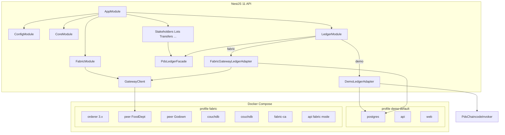
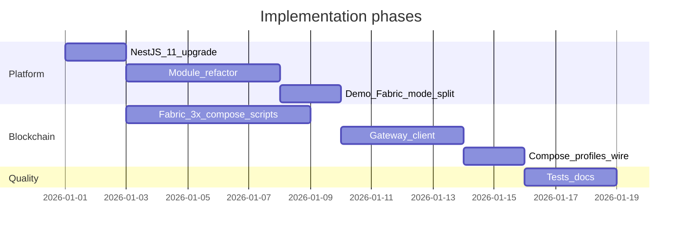

# NestJS 11 + Modular API + Fabric 3.x Gateway Path

## Goals

1. **NestJS best practices** — feature modules, `ConfigModule`, shared core/ledger providers, thin controllers.
2. **NestJS 11.x** — upgrade from 10.4.x (Node 22 in [`apps/api/Dockerfile`](apps/api/Dockerfile) already satisfies Nest 11’s Node 20+ requirement).
3. **Live Fabric 3.x demo** — minimal **2-org** network (1 Raft orderer + 2 peers) in Docker, chaincode deployed via lifecycle, API talks to peers via **`@hyperledger/fabric-gateway`** (NBF-LITE gateway sample pattern, not legacy `fabric-network` 2.2).
4. **Preserve POC** — current simulator becomes explicit **Demo mode**; no deletion of `PdsChaincodeInvoker` / `chaincode-runtime` path.

---

## Target architecture



---

## Phase 1 — NestJS 11 upgrade (low risk, do first)

**Files:** [`apps/api/package.json`](apps/api/package.json), root [`package-lock.json`](package-lock.json), [`apps/api/Dockerfile`](apps/api/Dockerfile)

- Bump `@nestjs/common`, `@nestjs/core`, `@nestjs/platform-express` to **^11.x**.
- Add `@nestjs/config` for typed env loading.
- Run existing Vitest suite; fix any Express 5 / path-matching issues if they surface (unlikely for this flat-route API).
- Confirm Node **22** in Docker (already set).

---

## Phase 2 — NestJS modular structure

Reorganize [`apps/api/src/`](apps/api/src/) without changing HTTP paths or domain behavior.

### Proposed layout

```
apps/api/src/
  main.ts
  app.module.ts
  modules/
    config/           # ConfigModule + fabric/persistence env validation
    core/             # PdsLedgerFacade, bootstrap OnModuleInit
    ledger/           # Ledger port factory, demo/fabric adapter selection
    fabric/           # Gateway connection, identity, wallet helpers
    health/           # GET /health, GET /, GET /docs
    openapi/          # GET /openapi.json
    dashboard/
    stakeholders/
    lots/
    transfers/
    allocations/      # fps-allocations
    auth/
    entitlements/
    distributions/
    trace/
    audit/
  infrastructure/     # MOVE (no Nest decorators): postgres-*, ledger-port.ts, sync-await
  domain/             # KEEP: pds-runtime.ts logic OR fold into core
```

### Module responsibilities

| Module | Controller routes | Notes |
|--------|-------------------|-------|
| `HealthModule` | `/`, `/docs`, `/health` | From [`api-pages.ts`](apps/api/src/api-pages.ts) |
| `OpenapiModule` | `/openapi.json` | From [`openapi.ts`](apps/api/src/openapi.ts) |
| `DashboardModule` | `/dashboard/summary` | |
| `StakeholdersModule` | `/stakeholders` | DTOs from split [`dto.ts`](apps/api/src/dto.ts) |
| `LotsModule` | `/lots`, `/lots/:id/history` | |
| `TransfersModule` | `/transfers` | |
| `AllocationsModule` | `/fps-allocations` | |
| `AuthModule` | `/auth/*` | |
| `EntitlementsModule` | `/entitlements` | |
| `DistributionsModule` | `/distributions` | |
| `TraceModule` | `/trace/*` | |
| `AuditModule` | `/audit-alerts` | |

### Core pattern (critical constraint)

[`PdsLedgerEngine`](blockchain/chaincode/pds-chaincode/src/index.ts) is a **single in-memory state machine**. Feature modules must **not** each own a copy.

- **`CoreModule`** (`@Global()`): exports `PdsLedgerFacade` — thin injectable over current [`PdsRuntime`](apps/api/src/pds-runtime.ts) behavior.
- **`LedgerModule`**: provides `PDS_LEDGER_PORT` token via factory reading `ConfigService`.
- Controllers inject `PdsLedgerFacade` only; no direct `createLedgerPortFromEnv()` in constructors.

Split [`pds.controller.ts`](apps/api/src/pds.controller.ts) (~230 lines) into ~10 controllers; **keep URL paths identical** so web/Swagger clients do not break.

### Nest patterns to add now (production-oriented, still MVP-sized)

- `@nestjs/config` + validated config objects (replace scattered `process.env` in [`fabric-config.ts`](apps/api/src/fabric-config.ts), [`persistence-config.ts`](apps/api/src/persistence-config.ts)).
- `ConfigModule.forRoot({ isGlobal: true })` in [`app.module.ts`](apps/api/src/app.module.ts).
- Optional: `@nestjs/swagger` later; keep hand-rolled `/docs` for now to limit scope.
- Defer **JWT/Auth guards** to a follow-up unless you want them in the same PR (not required for Fabric demo).

---

## Phase 3 — Explicit Demo vs Fabric ledger modes

**Problem today:** `fabric-gateway` aliases to `chaincode-runtime` in [`ledger-port-factory.ts`](apps/api/src/ledger-port-factory.ts) line 10 — misleading.

### New env model (backward compatible)

| Variable | Values | Meaning |
|----------|--------|---------|
| `PDS_LEDGER_MODE` | `demo` (default) \| `fabric` | Top-level switch |
| `PDS_PERSISTENCE_BACKEND` | `file` \| `postgres` | Unchanged |
| `PDS_LEDGER_BACKEND` | deprecated alias | Map `chaincode-runtime` → `demo`, `fabric-gateway` → `fabric` |

**Demo mode** (current POC):

- `PostgresChaincodeLedgerPort` / `FabricChaincodeLedgerPort` + `PdsChaincodeInvoker`
- No Fabric containers required

**Fabric mode**:

- New `FabricGatewayLedgerPort` implementing `PdsLedgerPort` + `ChainQueryPort`
- Writes: Postgres snapshot + `submitTransaction` on `pds-chaincode` (dual-write, same intent as today)
- Reads for trace: `evaluateTransaction` on peer

Keep [`FabricEnvelopeLedgerPort`](apps/api/src/fabric-envelope-ledger-port.ts) and `local-file` as **test-only** adapters behind `PDS_LEDGER_BACKEND=local-file|fabric-envelope` for dev tooling.

---

## Phase 4 — Fabric Gateway client (NBF-LITE pattern, modernized)

**Reference:** [`NBF-LITE/nbf-samplerest/application-gateway-typescript/src/app.ts`](NBF-LITE/nbf-samplerest/application-gateway-typescript/src/app.ts)

**Do not port** legacy [`fabric-network`](NBF-LITE/nbf-samplerest/package.json) 2.2 helpers for the PDS API.

### New dependencies in `apps/api`

- `@hyperledger/fabric-gateway` (latest 1.x)
- `@grpc/grpc-js`

### New files under `modules/fabric/`

- `fabric-gateway.client.ts` — implements existing [`FabricClient`](apps/api/src/fabric-client.ts) + [`ChainQueryPort`](apps/api/src/chain-query-port.ts)
- `fabric-gateway.connection.ts` — gRPC + TLS (`createSsl`), `grpc.ssl_target_name_override`, identity + `signers.newPrivateKeySigner`
- `fabric-identity.service.ts` — load MSP cert/key from mounted crypto paths (wallet optional later)
- `fabric-gateway.ledger-port.ts` — `FabricGatewayLedgerPort` wired into ledger factory

### Invoke contract (matches `PdsChainContract`)

From [`fabric-contract.json`](blockchain/fabric-network/fabric-contract.json):

```typescript
// submit (writes)
contract.submitTransaction('DispatchLot', JSON.stringify(payload))
// evaluate (reads)
contract.evaluateTransaction('GetLotHistory', JSON.stringify({ lotId }))
```

Channel: `pdschannel`, chaincode: `pds-chaincode`.

### Config env (add to `fabric-env.example` + `ConfigModule`)

- `PDS_FABRIC_PEER_ENDPOINT` (e.g. `peer0.food.example.com:7051`)
- `PDS_FABRIC_PEER_TLS_CERT_PATH`
- `PDS_FABRIC_PEER_HOST_ALIAS`
- `PDS_FABRIC_MSP_ID`
- `PDS_FABRIC_CERT_PATH` / `PDS_FABRIC_KEY_PATH`
- `PDS_FABRIC_CHANNEL` / `PDS_FABRIC_CHAINCODE` (defaults from manifest)

Reuse org mapping from [`fabric-config.ts`](apps/api/src/fabric-config.ts) (`PDS_FABRIC_CLIENT_ORG`).

---

## Phase 5 — Fabric 3.x minimal Docker (2-org)

**User choice:** 1 orderer + **2 orgs/peers** (expand to 5-org later).

### Replace genesis-based scaffold

Current [`docker-compose.fabric.yml`](blockchain/fabric-network/docker-compose.fabric.yml) uses **Fabric 2.5.16 + `ORDERER_GENERAL_GENESISFILE`** — invalid for Fabric 3.x.

### New stack (Fabric **3.1.x** latest patch, e.g. `3.1.5`)

Services:

- `orderer` — `ORDERER_GENERAL_BOOTSTRAPMETHOD=none`, `ORDERER_CHANNELPARTICIPATION_ENABLED=true`, admin TLS
- `peer0.food` + `peer0.godown` (map to **FoodAndCivilSupplies** + **GodownWarehouse** MSPs)
- `couchdb0`, `couchdb1`
- `ca.food`, `ca.godown` (or single CA for dev)
- Shared network `pds-fabric`

**2-org rationale:** proves multi-org endorsement without 5-peer operational cost; aligns with PDS supply-chain (department + godown).

### Bootstrap scripts (new, replace stubs)

Under [`blockchain/fabric-network/scripts/`](blockchain/fabric-network/scripts/):

1. `generate-crypto.sh` — Fabric CA enroll or `cryptogen` for dev
2. `configtxgen` — `pdschannel` block (no system channel)
3. `osnadmin channel join` — Fabric 3 orderer join
4. `peer channel join` — both peers
5. `deploy-chaincode.sh` — package [`pds-chaincode`](blockchain/chaincode/pds-chaincode), install/approve/commit on `pdschannel`
6. `smoke-fabric.sh` — submit `RegisterStakeholder` + `GetLotHistory` via `peer chaincode invoke/query`

**Pragmatic shortcut:** adapt `fabric-samples/test-network` scripts for 2 orgs, then swap chaincode name to `pds-chaincode` and channel to `pdschannel`. Check in only PDS-specific config (not entire fabric-samples tree).

### Root compose integration

Extend [`docker-compose.yml`](docker-compose.yml):

```yaml
profiles:
  - demo    # default: postgres + api (PDS_LEDGER_MODE=demo) + web
  - fabric  # adds fabric services + api with PDS_LEDGER_MODE=fabric
```

- `docker compose up` → current POC unchanged
- `docker compose --profile fabric up` → live blockchain demo

Mount crypto + connection material into API container; `depends_on` peer healthchecks.

### Connection profiles

Regenerate 2-org profiles in [`connection-profiles/`](blockchain/fabric-network/connection-profiles/) with TLS CA paths, orderer endpoints, peer `grpcs` URLs — implement [`generate-connection-profiles.sh`](blockchain/fabric-network/scripts/generate-connection-profiles.sh) (currently a stub).

---

## Phase 6 — Tests and verification

| Test | Purpose |
|------|---------|
| Existing Vitest (`apps/api/test/*`) | Must stay green after module refactor |
| New `fabric-gateway.client.spec.ts` | Mock gRPC / contract submit+evaluate |
| New `ledger-mode.factory.spec.ts` | `demo` vs `fabric` port selection |
| Optional e2e script | `scripts/smoke-fabric-gateway.mjs` against `--profile fabric` stack |
| Nest `Test.createTestingModule` | One module test per feature module (health + stakeholders) |

**Exit criteria (matches MVP plan intent):**

- `docker compose --profile fabric up` → API healthy, `POST /stakeholders` commits to real Fabric
- `GET /trace/lots/:id` returns `verificationSource: 'chaincode'` from peer evaluate
- `docker compose up` (demo profile) → identical POC behavior as today

---

## Phase 7 — Documentation updates

Update (after implementation):

- [`DEPLOYMENT.md`](DEPLOYMENT.md) — Fabric 3.x 2-org profile, env matrix, demo vs fabric modes
- [`blockchain/fabric-network/README.md`](blockchain/fabric-network/README.md) — remove “scaffold only” where implemented
- [`README.md`](README.md) — `docker compose --profile fabric` quickstart
- [`docs/implementation/mvp-implementation-plan.md`](docs/implementation/mvp-implementation-plan.md) — mark Gate 1/2 progress

---

## Suggested implementation order



Work can parallelize: **Fabric Docker/scripts** (Phase 5) alongside **Nest module refactor** (Phase 2) after Phase 1 lands.

---

## Out of scope (follow-up PRs)

- Full **5-org** PDS manifest deployment
- JWT auth / role guards (`AuthModule` structure only, guards later)
- `@nestjs/swagger` codegen (keep static OpenAPI)
- Fabric 3 **SmartBFT** orderer (stick to single-node Raft for minimal demo)
- Web `VITE_API_BASE_URL` Docker fix (separate from this plan)

---

## Key files to change (summary)

| Area | Primary files |
|------|----------------|
| Nest upgrade | `apps/api/package.json`, Dockerfiles |
| Modules | `app.module.ts`, new `modules/**`, split `pds.controller.ts`, `dto.ts` |
| Demo/Fabric | `ledger-port-factory.ts`, new `fabric-gateway.*.ts` |
| Fabric 3 Docker | `blockchain/fabric-network/docker-compose.fabric.yml`, new bootstrap scripts |
| Compose | `docker-compose.yml` profiles + fabric env |
| NBF reference | Port patterns from `application-gateway-typescript/src/app.ts` only |
