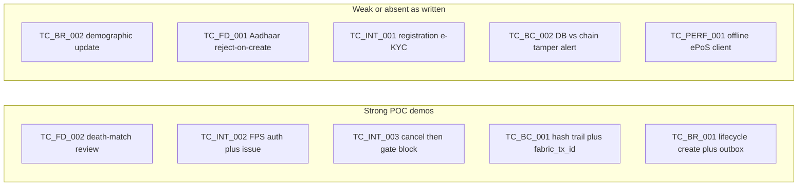

# POC Test-Case Gap Analysis

**Date:** 2026-07-29  
**Branch:** `docs/poc-test-case-gap-analysis`  
**Source test cases:** [Draft a test case document for the attached file. ....pdf](../requirements/Draft%20a%20test%20case%20document%20for%20the%20attached%20file.%20....pdf)  
**Requirement document:** [Blockchain-Enabled Beneficiary Registry Management and Fraud Detection for Public Distribution System (PDS).pdf](../requirements/Blockchain-Enabled%20Beneficiary%20Registry%20Management%20and%20Fraud%20Detection%20for%20Public%20Distribution%20System%20(PDS).pdf)  
**Target application cited in test doc:** `https://demo.vikshitpds.in`

**Related maintained docs:** [poc-test-case-demo-checklist.md](poc-test-case-demo-checklist.md) (facilitator runbook), [beneficiary-registry-alignment.md](beneficiary-registry-alignment.md), [challenge-readiness-plan.md](challenge-readiness-plan.md), [ghost-detection-impl.md](ghost-detection-impl.md), [eligibility-trust-lifecycle-capability-audit.md](eligibility-trust-lifecycle-capability-audit.md), [audit-logging-poc-assessment.md](audit-logging-poc-assessment.md), [mvp-hardening-plan.md](mvp-hardening-plan.md), [assumptions-for-demo.md](../product/assumptions-for-demo.md).

## Verdict

ViksitPDS can support an **honest controlled POC** for privacy-safe beneficiary lifecycle proofs, mocked ghost/death review, simulated ePoS auth/distribution with post-decision blocking, and Fabric transaction-ID audit trails. It does **not** meet the draft test cases as written where they assume a full demographic registry SoR, registration e-KYC, live civil-registration sync, cleartext Beneficiary ID on-chain search, DB↔blockchain quantity tamper alerts, municipal→central registry sync, or a field offline ePoS client.

| Count | Status |
|------:|--------|
| 0 | Fully IMPLEMENTED as written |
| 10 | PARTIAL and/or MOCKED with remappable demo paths |
| 3 | NOT_IMPLEMENTED (`TC_BR_002`, `TC_FD_001`, `TC_INT_001`) |
| 1 | PARTIAL with strong architectural mismatch (`TC_BC_002`, also `TC_SYNC_001`) |

## Status legend

| Status | Meaning |
|--------|---------|
| IMPLEMENTED | Core expected behavior exists end-to-end in the controlled demo |
| PARTIAL | Significant path exists; key expected outcomes missing or privacy/architecture constrained |
| MOCKED | Behavior is fixture-/simulation-driven rather than live government integrations |
| NOT_IMPLEMENTED | Expected capability is absent |

## Executive scorecard

| ID | Scenario | Status | Demo-ready? |
|----|----------|--------|-------------|
| TC_BR_001 | Create beneficiary + blockchain hash | PARTIAL | Yes — opaque create + async `fabric_tx_id` |
| TC_BR_002 | Update demographics + history | NOT_IMPLEMENTED | No as written; state/migration only |
| TC_BR_003 | Family bifurcation + lineage | PARTIAL | Partial — household shrink; no child card lineage |
| TC_BR_004 | Deceased/ineligible + revoke | PARTIAL / MOCKED | Yes — after RCMS cancel/removal, not death alone |
| TC_FD_001 | Duplicate Aadhaar reject-on-create | NOT_IMPLEMENTED | No; show linkage *review* instead |
| TC_FD_002 | Ghost/deceased from CRS sync | MOCKED | Yes — strongest fraud demo |
| TC_FD_003 | Cross-district duplicate flag | PARTIAL / MOCKED | Yes — JK opaque linkage review |
| TC_INT_001 | Registration e-KYC (OTP/bio) | NOT_IMPLEMENTED | No; FPS/citizen auth ≠ registration e-KYC |
| TC_INT_002 | ePoS distribution vs registry | PARTIAL / MOCKED | Yes — FPS auth + distribute |
| TC_INT_003 | Attempt distribution to deactivated/ghost | PARTIAL / MOCKED | Yes — **Ineligible Beneficiary** after cancel/removal; ghost alone does not block |
| TC_BC_001 | Audit trail by Beneficiary ID | PARTIAL | Yes — hash-keyed `GET /ledger-proofs?…` + Fabric TX IDs + Trust search |
| TC_BC_002 | DB vs blockchain tamper alert | PARTIAL / mismatched | Partial — immutability + completeness/drift only |
| TC_SYNC_001 | Multi-agency → central registry sync | PARTIAL / mismatch | Soft — fixture ingest + 2-org Fabric proofs |
| TC_PERF_001 | Offline ePoS reconnect, no dupes | PARTIAL | Soft — idempotent `sourceEventId` ingest |

## Architectural mismatch (first-class finding)

The draft test cases often treat ViksitPDS as the **beneficiary registry system of record**. Product architecture (see `AGENTS.md` and [beneficiary-registry-alignment.md](beneficiary-registry-alignment.md)) is different:

1. **Complementary trust layer.** SMART-PDS/RCMS remains the real beneficiary/ration-card SoR. ViksitPDS stores an operational projection, workflow history, and privacy-safe Fabric proofs.
2. **Privacy-safe proofs only.** No Aadhaar, biometrics, OTP, mobile, full ration-card values, unmasked names, or addresses in Fabric proofs, proof fixtures, or error messages. Search keys are `beneficiaryRefHash` / opaque refs, not cleartext Beneficiary IDs.
3. **PostgreSQL authoritative; Fabric async.** Create/update returns operational success and a `proofEventId`. Durable `fabric_tx_id` appears after outbox commit. Fabric delay must not roll back a valid PostgreSQL operation.
4. **Non-blocking screening.** Death/duplicate screening opens human review; only an authorized mock RCMS decision or explicit removal gates FPS distribution.
5. **Controlled-demo persistence.** Single API replica; snapshot/outbox honesty still incomplete for supply-chain paths. Do not claim crash atomicity or concurrent mutation safety.

Evaluators should score the POC against this complementary-layer reading, or the literal test wording will systematically fail cases that the product intentionally does not own.

---

## Module 1: Beneficiary Registry & Lifecycle Management

### TC_BR_001 — Create new valid beneficiary record

**Status:** PARTIAL  
**Expected:** Demographic data + unique ID + blockchain transaction hash on create.

**Evidence**

| Layer | Path |
|-------|------|
| Types | `packages/shared-types/src/beneficiary-registry.ts` (`BENEFICIARY_CREATED`) |
| API | `POST /beneficiary-registry/v1/events`, `GET /beneficiary-registry/v1/summary` — `apps/api/src/modules/beneficiary-registry/` |
| Persistence + outbox | `beneficiary-registry.repository.ts` (projection + `beneficiary_lifecycle_events` + `ledger_outbox`) |
| Schema | `infra/postgres/schema.sql` (`beneficiary_registry_projection`, `beneficiary_lifecycle_events`) |
| UI | `/m/eligibility` — “Register lifecycle record” — `EligibilityReviewPage.tsx` |
| Script / tests | `scripts/live-beneficiary-lifecycle.mjs`; `apps/api/test/beneficiary-registry.spec.ts` |
| Chaincode | Accepts `BENEFICIARY_CREATED` proof event type |

**Gaps:** No demographic fields on the registry projection (hashes, district, household size, state only). Create returns `proofEventId`; Fabric `fabric_tx_id` is asynchronous. In-memory path does not enqueue Fabric.

**Can / cannot:** Can create opaque unique record and show pending→committed proof with Postgres + Fabric. Cannot store real demographics or return a committed Fabric TX hash synchronously on create.

### TC_BR_002 — Update existing beneficiary demographic details

**Status:** NOT_IMPLEMENTED  
**Expected:** Update demographics; retain historical prior data; blockchain record of modification.

**Nearest paths:** `STATUS_CHANGED`, `MIGRATION_RECORDED`; event history + `projection_snapshot` in `beneficiary_lifecycle_events`. DTO has no name/address/DOB. Citizen portal has no demographic edit.

**Gaps:** No demographic update event/API; proofs intentionally exclude personal data.

**Can / cannot:** Can migrate district, change registry state, append auditable lifecycle events + proofs. Cannot update name/address/DOB or show historical demographic priors on-chain or in registry.

### TC_BR_003 — Family bifurcation

**Status:** PARTIAL  
**Expected:** Split family card; linked lineage recorded on blockchain.

**Evidence:** `HOUSEHOLD_BIFURCATED` reduces `householdSize`; optional `parentBeneficiaryRefHash` validated but unused by UI/live script; proof payload does not include parent lineage hash.

**Gaps:** No child ration-card / second projection; no linked parent–child lineage in Fabric payload; not wired from screening household-split signals.

**Can / cannot:** Can record bifurcation, shrink household, queue privacy-safe proof. Cannot split into two linked cards with on-chain lineage.

### TC_BR_004 — Mark beneficiary Deceased / Ineligible

**Status:** PARTIAL / MOCKED  
**Expected:** Upload death certificate; mark deceased/ineligible; revoke distribution eligibility immediately.

**Evidence:** `DEATH_MATCH_REVIEW` for `BEN-DEMO-001` (`apps/eligibility-mock/src/screening.ts`); verification `DECEASED_MEMBER_CONFIRMED` → `MEMBER_REMOVED`; immediate block only after `CARD_CANCELLED` / `TEMPORARILY_SUSPENDED`, officer removal, or citizen surrender → gate + `RECORD_DEACTIVATED`.

**Gaps:** No death-certificate (or any file) upload — only `evidenceDigest` hashes. Member death verification does not revoke household entitlement immediately. Death registry is simulated.

**Can / cannot:** Can run death-match review → confirm deceased member → cancel/suspend/remove and block FPS. Cannot upload death cert; auto-revoke on death signal alone; live death-registry integration.

---

## Module 2: Fraud & Ghost Beneficiary Detection

### TC_FD_001 — Duplicate Beneficiary Prevention (Aadhaar / Demographic match)

**Status:** NOT_IMPLEMENTED  
**Expected:** Create with existing Aadhaar X → reject, flag duplicate, log attempt.

**Adjacent only:** Same `beneficiaryRefHash` create conflict; JK screening `DUPLICATE_RECORD_REVIEW` via opaque `linkageDigest` (explicitly not Aadhaar match); FPS `AADHAAR_DEMOGRAPHIC_MISMATCH` is auth-time, not registration.

**Gaps:** No create-time Aadhaar/demographic match; no failed-registration attempt audit; duplicates open review rather than reject-on-create.

**Demo remap:** JK duplicate screening / officer `DUPLICATE_RECORD` removal — do not claim Aadhaar reject-on-create.

### TC_FD_002 — Flagging Ghost / Deceased Beneficiaries

**Status:** MOCKED  
**Expected:** Death report synced from civil registration → flag for removal/verification.

**Evidence:** On-demand `POST /v1/screenings` → `DEATH_MATCH_REVIEW` / `DEATH_REGISTRY` for `BEN-DEMO-001`; eligibility case workflow; UI Eligibility review; visual pass in `ghost-beneficiary-eligibility-visual-test.md`.

**Gaps:** Mock pull, not CRS push sync. Screening alone never blocks benefits.

**Demo remap:** Strongest fraud path — Control Office screens Asha Patil → death-match case → guided verification/decision.

### TC_FD_003 — Cross-district duplicate record flag

**Status:** PARTIAL / MOCKED  
**Expected:** Same demographic/biometric across two districts → admin multi-district alert.

**Evidence:** Shared `DUPLICATE_LINKAGE_DIGEST` on `BEN-JK-DEMO-001` / `001B`; fixtures have distinct `districtCode`s. Migration (`MIGRATION_RECORDED`) is a separate path.

**Gaps:** No create-time cross-district biometric/demographic engine; no dedicated multi-district admin alert type.

**Demo remap:** JK duplicate linkage review; optionally show inter-district migration as a different story.

---

## Module 3: Aadhaar, e-KYC & ePoS Integration

### TC_INT_001 — e-KYC Authentication during registration

**Status:** NOT_IMPLEMENTED  
**Expected:** During registration, Aadhaar → OTP/biometric e-KYC → matched demographics.

**Adjacent only:** FPS ePoS auth mock (`/auth/mock-otp`, `/auth/simulated-biometric`); citizen `/citizen` Aadhaar→OTP for read-only self-service. Registry “Register lifecycle record” has no e-KYC step.

**Gaps:** No registration e-KYC wizard; no UIDAI sandbox; no demographic match return path for registration.

**Demo remap:** FPS auth or citizen login only — label as **not** registration e-KYC. Prefer documenting this TC as RCMS-owned / out of trust-layer scope.

### TC_INT_002 — Validate ePoS Food Grain Distribution against Registry

**Status:** PARTIAL / MOCKED  
**Expected:** ePoS session → authenticate → confirm eligibility, distribute, log transaction.

**Evidence:** FPS auth → `POST /distributions`; engine checks auth success + entitlement; `assertEligibilityGateOpen`; `scripts/live-fps-auth-lifecycle.mjs`; fixture ingest `POST /integrations/epos/v1/distribution-events`.

**Gaps:** Simulated terminal; distribute does not read registry projection state directly; integration is event ingest, not live registry validation of a physical terminal.

**Demo remap:** FPS-101 OTP/biometric success → issue grain (stock required) → receipt/proof.

### TC_INT_003 — Distribution to deactivated / ineligible / ghost — blocked

**Status:** PARTIAL / MOCKED  
**Expected:** Deactivated or ghost at ePoS → blocked with “Ineligible Beneficiary” notice.

**Evidence:** Blocked after auth `FAILURE`, RCMS cancel/suspend, or officer/citizen removal. Ghost screening alone allows distribution until RCMS decision. Gate/UI notice is **Ineligible Beneficiary** with machine reason `EFFECTIVE_RCMS_DECISION`; FPS distribute returns HTTP 400 with `code: INELIGIBLE_BENEFICIARY` (ration-card hash omitted from client message). Postgres distribute path asserts the gate before `executeMutationTx`.

**Gaps:** Registry `DEACTIVATED` is not independently checked inside `recordDistribution` unless the eligibility gate path is set.

**Demo remap:** Cancel/remove then gate + FPS fail with Ineligible Beneficiary. Do not claim ghost flag alone blocks.

---

## Module 4: Blockchain Immutability & Audit Trail

### TC_BC_001 — Audit Trail Verification for Record Creation & Updates

**Status:** PARTIAL  
**Expected:** Search by Beneficiary ID; complete history with cryptographic transaction IDs.

**Evidence:** Lifecycle events keyed by `beneficiaryRefHash` → `ledger_events` + `ledger_outbox`; real Fabric `fabric_tx_id` via `RecordLedgerProof`; **`GET /ledger-proofs?entityId=` / `beneficiaryRefHash=`** (auditor/management/platform-admin) joins events to outbox; `GET /ledger-proofs/:eventId`, `GET /admin/proofs/summary`; Trust UI **Hash-keyed proof trail** search in `FabricAnalyticsPanel`; `scripts/live-lifecycle.mjs` waits for `COMMITTED` + `fabricTxId`.

**Gaps:** No search-by-cleartext-Beneficiary-ID (intentional privacy). Proof actor often hardcoded `SYSTEM` / `pds-api`.

**Claim language:** “Privacy-safe, hash-keyed audit trail with cryptographic Fabric transaction IDs,” not “search Fabric by Beneficiary ID.”

### TC_BC_002 — Data Tamper Resistance Check

**Status:** PARTIAL / mismatched  
**Expected:** Detect discrepancy between centralized DB and blockchain; raise security alert.

**Evidence:** Identical proof replay OK; conflicting `eventId` fails; payload hash checked. Completeness/drift alerts in `ProofsService.buildCompleteness()` (missing proof, dead-letter, digest/projection drift). `DB_LEDGER_MISMATCH` used for integration conflict / quantity reconcile **inside PostgreSQL**, not DB↔Fabric. `DISTRIBUTION_TAMPERED` enum unused.

**Gaps:** No job comparing operational DB quantities to Fabric state. No “re-fetch proof from peer and compare” auditor API. Naive full-row-on-chain compare would violate privacy; correct path is hash/envelope compare (started in completeness analytics, not a security-alert workflow).

**Do not claim:** automated security alert when someone edits PostgreSQL stock behind the ledger. **Can claim:** tamper-evident proofs; Trust completeness/drift; operational audit alerts.

---

## Module 5: Multi-Agency Synchronization & Performance

### TC_SYNC_001 — Multi-Agency Data Synchronization

**Status:** PARTIAL / architectural mismatch  
**Expected:** Municipal/external node update syncs to central PDS registry near real-time.

**Evidence:** Two-org Fabric (Food + Godown) dual endorsement syncs **proofs**, not municipal master data. Fixture adapters ingest SMART-PDS / SCM / ePoS into ViksitPDS. Outbox ~2s poll for proof commit.

**Gaps:** ViksitPDS is not the central SMART-PDS registry. No municipal node or outbound sync *to* central PDS. Only two Fabric orgs today.

**Claim language:** “Multi-agency *proof* synchronization on Fabric + multi-source *ingestion* into the trust layer,” not “municipal node updates central PDS master.”

### TC_PERF_001 — Low Connectivity / Offline Sync

**Status:** PARTIAL  
**Expected:** Offline ePoS transaction syncs to blockchain on reconnect without duplicates.

**Evidence:** Idempotent ingest on `(sourceSystem, sourceEventId)`; identical → `DUPLICATE`; conflict → `409` + alert; `deviceSyncAt` supported. Domain `DUPLICATE_CLAIM` / FPS duplicate-claim demo. Offline Android FPS out of MVP scope.

**Gaps:** No offline ePoS client/queue; web “offline mode” is fixtures, not reconnect. Supply-chain snapshot persistence still not crash/concurrent-safe.

**Claim language:** “Idempotent reconnect ingest for simulated AePDS/ePoS events,” not “field ePoS offline queue verified.”

---

## Recommended POC narrative (honest remaps)

| Show safely | Avoid claiming |
|-------------|----------------|
| Opaque lifecycle create + async Fabric TX ID | Sync blockchain hash returned on create with demographics |
| Death-match ghost **review** + human RCMS decision | Live CRS sync auto-ghosting / auto-block |
| Opaque duplicate linkage **review** | Aadhaar/demographic reject-on-create + attempt log |
| Simulated FPS OTP/biometric auth + entitlement/distribution | Registration e-KYC sandbox matching demographics |
| Block after cancel/suspend/removal / auth failure | Ghost flag alone blocks with “Ineligible Beneficiary” |
| Hash-keyed audit trail + Fabric TX IDs in Trust/admin | Search Fabric by cleartext Beneficiary ID |
| Proof immutability + completeness/drift alerts | Automated DB stock vs blockchain security alert |
| Multi-source fixture ingest + 2-org Fabric endorsement | Municipal→central SMART-PDS registry sync |
| Idempotent ePoS `sourceEventId` replay | Field offline ePoS device queue |

### Suggested live demo sequence

1. **Registry create (TC_BR_001):** department on `/m/eligibility` → Register lifecycle record → show `proofEventId` → poll Trust/admin until `COMMITTED` + `fabric_tx_id`. Optional: `scripts/live-beneficiary-lifecycle.mjs`.
2. **Ghost review (TC_FD_002):** screen `BEN-DEMO-001` → death-match case → verification → authorize cancel/suspend.
3. **Block at FPS (TC_INT_003):** show entitlement gate blocked → FPS distribute fails.
4. **Happy-path FPS (TC_INT_002):** separate active beneficiary → OTP/biometric success → distribute (stock prepared via lifecycle).
5. **Duplicate review (TC_FD_003 soft):** screen `BEN-JK-DEMO-001` linkage review.
6. **Idempotent reconnect (TC_PERF_001 soft):** replay same ePoS integration `sourceEventId`.
7. **Integrity narrative (TC_BC_002 soft):** show completeness/drift + conflicting proof replay, explain async lag ≠ tamper.

Compose notes: eligibility demo needs profile `eligibility` (+ schema migrate); FPS auth mock needs `epos` / `mocks`. Reset/reseed before external demos; report operational success and proof completion separately.

---

## Priority gaps for POC confidence

Only items that change what evaluators can verify.

| Priority | TC | Action if acceptance requires stricter pass | Status |
|----------|-----|-----------------------------------------------|--------|
| P0 narrative | All | Publish complementary-layer scoring guide alongside the draft TCs; mark `BR_002`, `FD_001`, `INT_001` as SoR/RCMS-owned or deferred | Checklist published |
| P1 demo UX | TC_BC_001 | Auditor query `GET /ledger-proofs?entityId=` / `beneficiaryRefHash=` joining `fabric_tx_id`; Trust UI hash-keyed search | **Done** (this branch) |
| P1 honesty | TC_INT_003 | FPS/gate “Ineligible Beneficiary” notice after gate block; keep ghost non-blocking until decision | **Done** (this branch) |
| P2 optional | TC_FD_001 | Create-time duplicate check on opaque `aadhaarRefHash` / approved linkage token with 409 + attempt audit — never store raw Aadhaar | Open |
| P2 optional | TC_BR_003 | Create child projection + include `parentBeneficiaryRefHash` in privacy-safe proof | Open |
| P2 optional | TC_BC_002 | Scheduled compare of COMMITTED `payloadHash` vs recomputed envelope + optional Fabric evaluate; distinct alert type (do not overload `DB_LEDGER_MISMATCH`) | Open |
| P2 optional | TC_PERF_001 | Scripted offline queue simulator exercising `deviceSyncAt` + duplicate suppression | Open |
| P3 pilot | TC_SYNC_001 / FD_002 | Approved SMART-PDS/RCMS, CRS, and ePoS contracts before claiming live sync | Open |

Do not mark near-MVP complete while critical/high gates in [mvp-hardening-plan.md](mvp-hardening-plan.md) remain open. A single-replica lifecycle pass is not evidence of crash atomicity, concurrent command safety, or production readiness.

## Key evidence anchors

| Area | Paths |
|------|-------|
| Registry | `apps/api/src/modules/beneficiary-registry/`, `scripts/live-beneficiary-lifecycle.mjs`, `/m/eligibility` |
| Screening | `apps/eligibility-mock/src/screening.ts`, eligibility gate + RCMS decisions |
| ePoS | `apps/epos-auth-mock/`, FPS distributions, `scripts/live-fps-auth-lifecycle.mjs` |
| Proofs | Outbox worker in `fabric-gateway.ledger-port.ts`, `GET /ledger-proofs/:eventId`, Trust/admin proof UI |
| Integrations | `apps/api/src/modules/integrations/` — SMART-PDS / SCM / ePoS fixture ingest |
| Alignment baseline | [beneficiary-registry-alignment.md](beneficiary-registry-alignment.md) |
