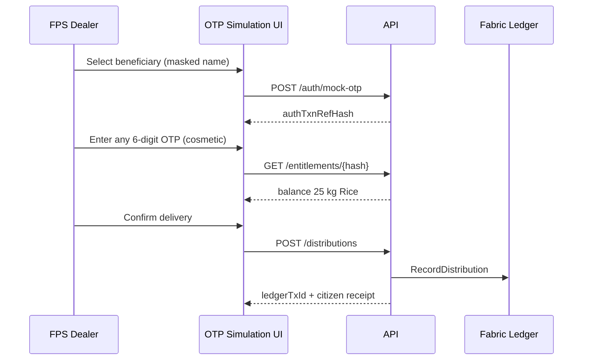

## Summary

**End distribution to beneficiary is implemented** — as a **mock/simulated** last-mile flow, not real UIDAI Aadhaar integration. The backend, chaincode, and workbench all support it; what’s missing is a **dedicated Aadhaar-style OTP screen** that makes the demo feel realistic.

---

## What exists today

The full PDS chain is wired:

```text
Procurement → FCI → Depot → Issue Point → RO-lite approval
  → Allocate to FPS → FPS receipt
  → Beneficiary auth (mock) → Entitlement check → RecordDistribution (ledger)
  → Audit / trace
```

### Backend (implemented)

| Step | API | Status |
|------|-----|--------|
| Mock OTP auth | `POST /auth/mock-otp` | Done |
| Simulated biometric | `POST /auth/simulated-biometric` | Done |
| Supervisor override | `POST /auth/supervisor-exception` | Done |
| Entitlement check | `POST /entitlements/validate` | Done |
| Record distribution | `POST /distributions` | Done |
| Trace proof | `GET /trace/distributions/:id` | Done |

Auth controller:

```22:28:apps/api/src/modules/auth/auth.controller.ts
  @Post('/auth/mock-otp')
  authOtp(@Body() body: AuthOtpDto) {
    return this.ledger.simulateAuthentication({
      ...body,
      authMode: AuthMode.MOCK_OTP
    });
  }
```

Chaincode enforces:
- Failed auth blocks distribution
- Entitlement balance / duplicate-claim checks
- FPS stock debit on delivery
- `RecordDistribution` ledger event with `ledgerTxId`

### Privacy (by design)

Per the feature spec, **raw Aadhaar, OTP, mobile, and full ration card numbers never go on-chain** — only hashes like `beneficiary-hash` and `demo-ration-card-hash`. Demo beneficiary: **"Beneficiary ****01"** in seed data.

Real Aadhaar/UIDAI is explicitly **out of scope** in the sprint backlog.

---

## The gap: UI doesn’t show a separate OTP step

The workbench bundles auth + distribution into one click:

```523:547:apps/web/src/workflow-actions.ts
  if (fpsAllocationReceived && !context.distributions.some((item) => item.distributionId === distributionId)) {
    const timestamp = getDistributionTimestamp(context, DEMO_RATION_CARD_HASH, route.commodity);
    actions.push({
      id: distributionId,
      label: `Authenticate and issue ${route.commodity} ration`,
      detail: 'FPS operator verifies the ration-card holder with mock OTP/biometric auth, records the household delivery, and writes the citizen receipt proof.',
      roles: ['FPS'],
      status: 'pending',
      request: {
        kind: 'distribute',
        payload: {
          distributionId,
          fpsId: 'FPS-101',
          rationCardHash: DEMO_RATION_CARD_HASH,
          beneficiaryRefHash: DEMO_BENEFICIARY_HASH,
          commodity: route.commodity,
          deliveredKg: Math.min(demoQuantities.citizenDistributionKg, commodityDefinition(route.commodity).defaultMonthlyEntitlementKg),
          authMode: AuthMode.MOCK_OTP,
          authResult: AuthResult.SUCCESS,
          authTxnRefHash: 'auth-ref-poc-001',
          ...
```

`api.ts` already supports a separate `kind: 'auth'` → `POST /auth/mock-otp`, but the workbench **never queues that step**. CLI demos do it correctly (auth first, then distribute):

```64:90:scripts/demo/fabric-api.mjs
  const auth = await request('/auth/mock-otp', {
    method: 'POST',
    body: JSON.stringify({
      authTxnId: `${prefix}-AUTH`,
      beneficiaryRefHash: 'beneficiary-hash',
      rationCardHash: 'demo-ration-card-hash',
      authMode: 'MOCK_OTP',
      authResult: 'SUCCESS'
    })
  });

  const distribution = await request('/distributions', {
    method: 'POST',
    body: JSON.stringify({
      ...
      authTxnRefHash: auth.authTxnRefHash,
      ...
    })
  });
```

The **Distribution page** is read-only panels (auth ledger, allocations, entitlements, distributions) — no interactive OTP form.

---

## How to showcase it today (no code changes)

### Option A — Live UI demo (fastest)

1. `docker compose up` → open the web app (typically `http://localhost:4173`)
2. Walk the supply chain: **PROCUREMENT → DEPOT → FPS** via Workbench
3. As **FPS**: run **"Authenticate and issue Rice ration"**
4. Open **Distribution** — see auth txn, entitlement, distribution with `ledgerTxId`
5. Switch to **Auditor** → **Verify** page for trace proof
6. Demo exceptions:
   - **"Attempt duplicate claim"** → blocked with audit alert
   - **"Approve supervisor exception issue"** → exception path with alert

### Option B — Scripted CLI demo

```bash
npm run demo:happy      # full happy path
npm run demo:exception  # duplicate claim / exceptions
npm run smoke           # both
```

With Fabric ledger: `scripts/demo/fabric-api.mjs` (needs `PDS_DEV_AUTH_TOKEN`).

### Option C — API curl (for technical audience)

Auth → distribute → trace, using the same hashes as seed data.

---

## Simulated Aadhaar OTP — suggested approach

You don’t need UIDAI. A **thin UI layer** on existing APIs is enough for a convincing showcase.

### Demo narrative (3-screen flow)



| Screen | What to show | Backend call |
|--------|--------------|--------------|
| 1. Identify beneficiary | Dropdown: "Beneficiary ****01" (maps to `demo-ration-card-hash`) | None (fixture) |
| 2. Aadhaar OTP | "OTP sent to registered mobile ****3210" — any 6 digits accepted | `POST /auth/mock-otp` |
| 3. Confirm issue | Entitlement balance + quantity + ledger proof | `GET /entitlements/...` then `POST /distributions` |

### Failure demos (same UI, different payloads)

| Scenario | How |
|----------|-----|
| OTP failed | `authResult: 'FAILURE'` → distribution blocked |
| Biometric fail + supervisor | `POST /auth/supervisor-exception` then distribute with `EXCEPTION_APPROVED` |
| Duplicate claim | Second distribution same month → `DUPLICATE_CLAIM` alert |
| Over-entitlement | `deliveredKg` > balance → rejected |

### Minimal implementation effort

| Change | Effort | Impact |
|--------|--------|--------|
| Split workbench into `kind: 'auth'` then `kind: 'distribute'` | Small | Aligns UI with CLI/e2e |
| Add `BeneficiaryOtpDialog` on Distribution/Workbench | Medium | Makes demo visually clear |
| Wire returned `authTxnRefHash` into distribute payload | Small | Proper auth→distribute link |
| Optional: SMS toast animation ("OTP sent") | Trivial | Polish |

**No new backend work required** — endpoints and chaincode logic already exist.

---

## What is NOT implemented (and shouldn’t be promised in a demo)

- Real UIDAI / Aadhaar OTP verification
- Real SMART-PDS / ePoS integration
- Dedicated beneficiary lookup API (`GET /beneficiaries/{hash}` — spec only)
- QR scan, citizen SMS/PDF receipt
- Strict validation that distribution’s `authTxnRefHash` matches a prior auth record (reference is passed but not cross-checked)

---

## Recommendation

For a **CDAC showcase**, I'd suggest:

1. **Short term (demo-ready):** Use the existing FPS workbench flow + Distribution/Audit pages, and narrate the OTP step verbally ("in production this would be UIDAI OTP; here we simulate it").
2. **Medium term (polished demo):** Add a simulated Aadhaar OTP dialog and split the workbench into two visible steps — this is ~1–2 days of frontend work, zero backend changes.
3. **Positioning:** Frame it as *"privacy-preserving, hash-based beneficiary verification with mock OTP — production would plug into UIDAI/ePoS via the same auth txn contract."*

If you want, I can implement the OTP simulation UI and split the workbench auth/distribute steps so the showcase matches the CLI flow end-to-end.