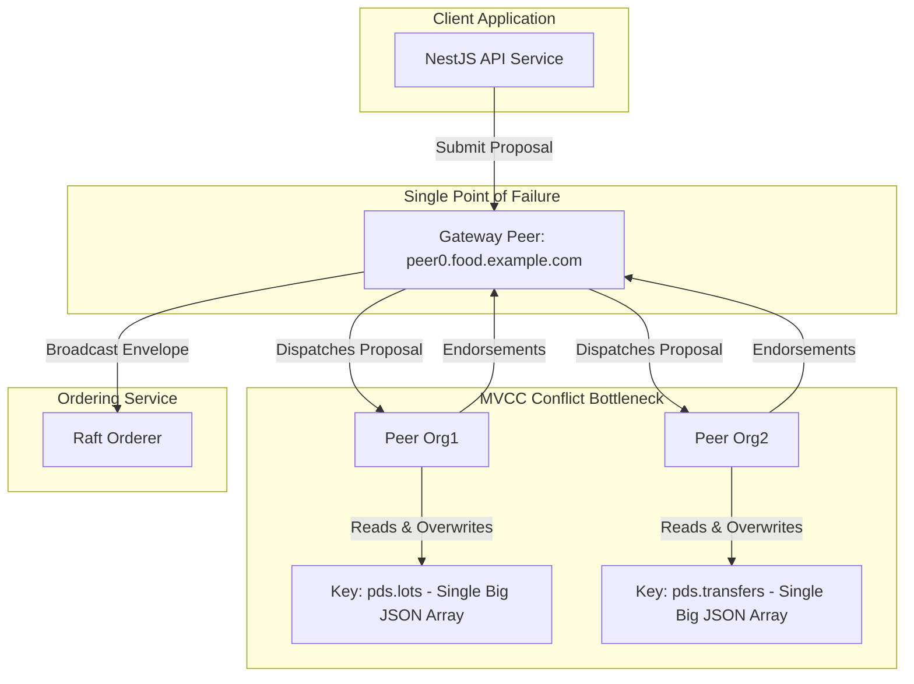

# Architectural Review & Gap Analysis: ViksitPDS MVP

> Historical architecture review. Its findings informed the maintained
> [architecture](../technical/architecture.md) and
> [hardening plan](../implementation/mvp-hardening-plan.md). Statements about
> current authority, authorization, or Fabric submission below are not current
> specifications.

This document contains a critical architectural review and gap analysis of the ViksitPDS project, focusing on two main areas:
1. **The Workflow Action Engine & State Transfers**
2. **The Hyperledger Fabric Integration Model (Gateway, Peers, and Endorsers)**

---

## 1. Workflow Action Engine & State Transfers Review

The ViksitPDS workflow action engine manages the custody transfer of food grains (e.g., Rice, Wheat) through various stakeholders (Procurement yards, FCI depots, state godowns, FPS shops) up to distribution to citizens.

### Current Implementation Characteristics
* **State Source of Truth:** On-chain via `PdsLedgerEngine` and off-chain via PostgreSQL tables (`transfer_orders`, `fps_allocations`, `stock_positions`).
* **Workflow Traversal:** The client (`apps/web/src/workflow-actions.ts`) reads the active lot's commodity, resolves the route template dynamically using `getPlannedLegs`, and compares it against the recorded `transfers` and `allocations` in the database context to determine the next "pending" action.
* **Transition Trigger:** Mutating operations (`dispatchLot`, `receiveLot`, `allocateToFps`, `recordFpsReceipt`, `recordDistribution`) act as the state-transition triggers.

### Strengths
1. **Engine Unification:** Sharing the `PdsLedgerEngine` between the frontend (for offline/demo simulations) and the backend/chaincode guarantees logic parity and prevents drift.
2. **Event-Sourced Integrity:** Key transitions append a `LedgerEvent` to the ledger, creating a tamper-evident audit trail of custody history.

---

### Critical Design Gaps in the Workflow Engine

#### A. Implicit State Resolution vs. Explicit Finite State Machine (FSM)
* **The Gap:** The engine does not store or track an explicit "Workflow Instance" status. Instead, the workflow position is calculated on-the-fly by querying historical arrays.
* **Risk:** This approach is fragile. If two lots of the same commodity are in transit simultaneously, the logic in `getWorkflowRoute()` ranks them by ID string and picks the highest one (`LOT-RICE-2026-001` vs `LOT-RICE-2026-002`). This assumes a strictly linear, single-stream pipeline.
* **Best-Practice Recommendation:** Transition to an explicit **Workflow Instance** asset model. Define a `WorkflowInstance` state object containing:
  ```json
  {
    "workflowInstanceId": "WF-RICE-2026-A1",
    "commodity": "Rice",
    "associatedLotId": "LOT-RICE-2026-001",
    "currentStage": "STAGE_II_DISPATCHED",
    "pendingRole": "DEPOT",
    "history": [...]
  }
  ```
  Transitions should explicitly mutate the instance's state machine, decoupling evaluation from generic database array queries.

#### B. Inventory Representation & In-Transit Limbo State
* **The Gap:** Stock is tracked in a flat `stock` map keyed by `(org, commodity)`. When a lot is dispatched, the sender's stock is immediately debited, but the receiver's stock is not credited until receipt.
* **Risk:** During transit, the stock exists in a "limbo" state. It does not belong to any organization's active inventory, and there is no explicit "in-transit" ledger pool. If a vehicle is delayed or lost, the stock is unaccounted for.
* **Best-Practice Recommendation:** Model an explicit **In-Transit / Custody** state in the stock ledger. The dispatch operation should transfer the stock from the sender's `Active` balance to a `Transit` balance associated with the `Transporter` and `TransferOrder`.

#### C. Static Route Configuration
* **The Gap:** The routes are hardcoded in `COMMODITY_ROUTE_TEMPLATES` within the `shared-types` library.
* **Risk:** Any change to a physical supply chain route (e.g., adding an intermediary warehouse or bypass) requires code modification, testing, rebuilds, and a chaincode upgrade.
* **Best-Practice Recommendation:** Move the route configurations on-chain as a governance asset (`RouteTemplate`). Allow Department Admins to register and update routes via transactions (using the control plane contract), which the engine then dynamically queries.

---

## 2. Hyperledger Fabric Integration Model Review

The project integrates with Hyperledger Fabric v3.1.x/v2.5.x using the modern `@hyperledger/fabric-gateway` client library.

### Current Implementation Characteristics
* **Gateway Library:** Utilizes the new Fabric Gateway API where the peer itself acts as the transaction coordinator (rather than the client SDK assembling endorsements).
* **Dual-Write Architecture:** The API writes to PostgreSQL first, then submits the event to Fabric.
* **MSP Authorization:** The chaincode asserts the calling identity's MSP ID before performing writes.

---

### Critical Design Gaps in the Fabric Integration



#### A. Fabric State Serialization Anti-Pattern (Big Blobs)
> [!CAUTION]
> **This is the most critical issue in the chaincode architecture.**
* **The Gap:** In `contract-base.ts`, entire collections are saved under single global keys (e.g., `pds.lots`, `pds.transfers`, `pds.events`) as large serialized JSON arrays:
  ```typescript
  export const loadCollection = async <T>(ctx: Context, key: CollectionKey): Promise<T[]> => {
    const raw = await ctx.stub.getState(KEYS[key]);
    return raw.length > 0 ? (JSON.parse(raw.toString()) as T[]) : [];
  };
  ```
* **Risk (MVCC Conflicts):** In Hyperledger Fabric, transactions commit in blocks. If two concurrent transactions read the same key (e.g., two different Fair Price Shops confirming receipt of different allocations, both reading and modifying `pds.allocations`), the transaction committed second will fail with an **MVCC (Multi-Version Concurrency Control) collision error**. In a real-world environment with parallel activity, **this will freeze the network, limiting transaction throughput to 1 write per block per collection**.
* **Risk (Performance Degeneration):** As the network accumulates records, these JSON arrays will grow to megabytes or gigabytes. Every transaction will require reading, parsing, modifying, serializing, and writing massive strings, quickly resulting in peer memory exhaustion.
* **Best-Practice Recommendation:** Store assets under **individual keys** using composite keys:
  ```typescript
  // Save an individual lot
  const lotKey = ctx.stub.createCompositeKey('lot', [lot.lotId]);
  await ctx.stub.putState(lotKey, Buffer.from(JSON.stringify(lot)));
  ```
  This isolates writes so that transactions on different lots do not touch the same state key, resolving MVCC conflicts entirely and keeping state size constant.

#### B. In-Memory Query Filtering on Global Collections
* **The Gap:** The chaincode implements queries like `GetLotHistory` and `GetDistributionHistory` by loading the entire global `events` collection into memory and filtering it in TypeScript.
* **Risk:** Over time, the history will grow to millions of events. Querying history this way will crash the peer container due to Out-Of-Memory (OOM) errors and cause extreme transaction timeouts.
* **Best-Practice Recommendation:** Use Fabric's native history tracking and rich query capability:
  1. For history, use `ctx.stub.getHistoryForKey(lotKey)` which retrieves only the cryptographic history of that specific asset.
  2. For structured state queries, use CouchDB rich queries with selector syntax:
     ```typescript
     const iterator = await ctx.stub.getQueryResult(JSON.stringify({
       selector: { docType: 'distribution', fpsId: fpsId }
     }));
     ```

#### C. Manual Endorsement Overrides Bypassing Service Discovery
* **The Gap:** In `fabric-gateway.client.ts`, the submit method explicitly overrides the endorsing organizations:
  ```typescript
  const resultBytes = await contract.submit(operation, {
    arguments: [JSON.stringify(payload)],
    endorsingOrganizations: this.config.endorsingOrgs // Overridden here
  });
  ```
* **Risk:** The `endorsingOrgs` config defaults to the client's own MSP ID. In a multi-org network where the chaincode endorsement policy requires signatures from multiple organizations (e.g., Food Dept AND Godown), forcing the Gateway to use only the client's organization will cause the transaction to fail committing.
* **Best-Practice Recommendation:** Omit `endorsingOrganizations` from the submission options. This allows the Fabric Gateway's built-in **Service Discovery** to automatically query the channel, identify the active endorsement policy, and route the proposal to a valid combination of endorsing peers.

#### D. Single Peer Connection (Single Point of Failure)
* **The Gap:** The API client establishes a connection to a single gRPC endpoint:
  ```typescript
  const client = new grpc.Client(config.peerEndpoint, tlsCredentials, ...);
  ```
* **Risk:** If that specific gateway peer goes down, the entire API backend becomes unavailable, even if the other peers in the network are healthy.
* **Best-Practice Recommendation:** Implement connection pooling or list multiple fallback peer endpoints in the configuration. Use a gRPC connection load-balancer or client-side retry loop over alternative peers.

#### E. Dual-Write Transaction Boundary & Inconsistency
* **The Gap:** The API writes to PostgreSQL and then writes to Hyperledger Fabric.
  ```typescript
  async appendEvents(events: LedgerEvent[]): Promise<void> {
    await this.postgresPort.appendEvents(events); // Primary write
    for (const event of events) {
      await this.gatewayClient.submitLedgerEventAsync(event); // Ledger write
    }
  }
  ```
* **Risk:** If the PostgreSQL write succeeds, but the subsequent Fabric write fails (due to timeout, endorsement failure, or channel congestion), the database is left in a state that has no matching blockchain proof. There is no automated transaction manager (like the Outbox Pattern) to retry or rollback the Postgres transaction.
* **Best-Practice Recommendation:** Implement the **Transactional Outbox Pattern**. Write the event to an `outbox` table in the PostgreSQL transaction. A background worker should poll the outbox, submit the events to Fabric, and mark them as processed once the block commit is confirmed. This guarantees eventual consistency.

---

## 3. Functional Code Verification & Gap Analysis

A walkthrough of the functional codebase reveals several architectural gaps between the current MVP and a production-ready enterprise deployment.

| Component | Current MVP Implementation | Target Production State | Gap Description & Risks |
| :--- | :--- | :--- | :--- |
| **Authentication & RBAC** | Token string verified via static `PDS_DEV_AUTH_TOKEN` in env. | OAuth2 / OIDC Integration (e.g., Keycloak) + fine-grained RBAC. | API controllers rely on loose token matching. There is no cryptographic verification of user roles, leading to potential privilege escalation. |
| **Credential Management** | Private keys loaded from local folder (`crypto/.../keystore`). | HSM (Hardware Security Module) / HashiCorp Vault. | Exposing raw `.pem` and private key files on disk is a high security vulnerability. |
| **Grievance Escalate** | Simulated in-memory check matching current timestamp. | Cron jobs/event triggers in worker nodes. | Scaling issues when checking SLAs across thousands of grievances using in-memory filters. |
| **Database Sync** | Replayed from memory via `postgres-snapshot.ts` on startup. | Real-time Debezium / CDC (Change Data Capture) or transaction hooks. | Database crashes can corrupt the memory-backed snapshot, requiring full ledger replays which slow down service startup. |

---

## 4. Summary of Key Risks & Remediation Plan

| Risk Level | Issue | Impact | Remediation |
| :--- | :--- | :--- | :--- |
| **CRITICAL** | **State Serialization Big Blobs (`pds.lots`, etc.)** | Causes severe MVCC conflicts and OOMs, locking throughput to 1 write/block. | Restructure state storage to use individual keys per asset via composite keys. |
| **HIGH** | **In-memory Query Filtering** | Chaincode queries will timeout and crash as the ledger event history grows. | Replace in-memory arrays with native history iterators and CouchDB rich queries. |
| **HIGH** | **Dual-Write Inconsistency** | System state split-brain (Postgres updated but Fabric transaction aborted). | Implement the Transactional Outbox Pattern to buffer blockchain writes. |
| **MEDIUM** | **Hardcoded Endorser Overrides** | Bypasses automatic discovery, risking endorsement validation failures. | Rely on Gateway Service Discovery instead of manual `endorsingOrganizations` overrides. |
| **MEDIUM** | **Single Gateway Peer Endpoint** | Single point of failure for all API blockchain interactions. | Configure fallback endpoints and gRPC failover/load balancing. |
