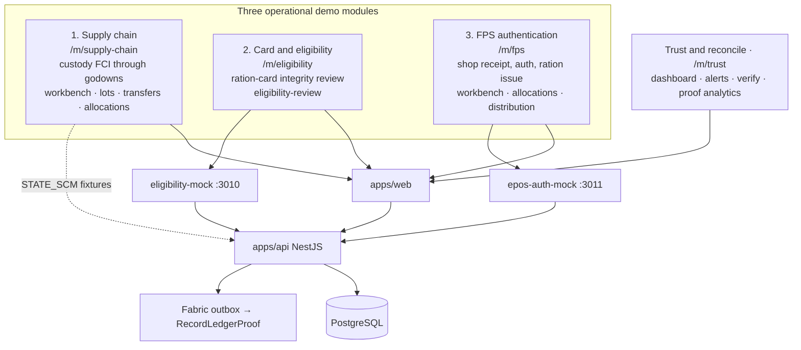
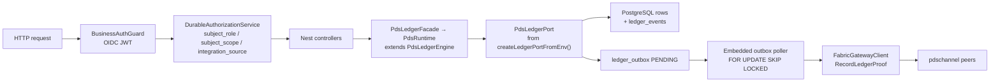

# ViksitPDS demo architecture (from code)

Derived from the repository runtime wiring on 2026-07-27 — not from the older
architecture narrative docs. Primary evidence:

- `apps/web/src/lib/modules.ts` + `docs/implementation/three-module-*.md`
- `docker-compose.yml` + `blockchain/fabric-network/docker-compose.fabric.yml`
- `apps/api/src/app.module.ts`, `ledger-port-factory.ts`, `fabric-gateway.ledger-port.ts`
- `infra/postgres/schema.sql`
- `blockchain/chaincode/pds-chaincode/src/operations.ts`

## Slide diagram

Use these companions for presentations:

- [viksitpds-demo-architecture.svg](./viksitpds-demo-architecture.svg) — crisp vector for slides / export
- [viksitpds-demo-architecture.png](./viksitpds-demo-architecture.png) — raster preview for decks

## Three operational modules (+ Trust overlay)

The demo story is **three operational modules**. Trust & reconcile is the
ViksitPDS oversight layer over those three — not a fourth upstream system.
Platform admin stays at `/admin`.



| Module | Path | Focus | Demo mock / fixture | Screens |
|---|---|---|---|---|
| **1. Supply chain** | `/m/supply-chain` | Custody from FCI through godowns to FPS allotment | In-app ops + supply fixtures | workbench, lots, transfers, allocations |
| **2. Card & eligibility** | `/m/eligibility` | Ration-card integrity / ghost-risk screening | `apps/eligibility-mock` `:3010` | eligibility-review |
| **3. FPS authentication** | `/m/fps` | Shop receipt, beneficiary auth, ration issue | `apps/epos-auth-mock` `:3011` | workbench, allocations, distribution |
| Trust & reconcile (overlay) | `/m/trust` | Cross-module oversight and proof analytics | PG outbox analytics + audit/verify | dashboard, stakeholders, audit-alerts, verify |

## System context (Compose runtime)

```mermaid
flowchart TB
  subgraph Clients
    WEB["apps/web<br/>3 modules + Trust overlay"]
    ADMIN["Admin plane<br/>/admin/*"]
  end

  KC["Keycloak<br/>profile: iam<br/>realm viksitpds"]

  subgraph Compose["docker-compose.yml"]
    API["apps/api<br/>NestJS<br/>PDS_PERSISTENCE_BACKEND=postgres"]
    PG[("PostgreSQL 16<br/>pds_chain")]
    ELIG["eligibility-mock<br/>module 2<br/>:3010"]
    EPOS["epos-auth-mock<br/>module 3<br/>:3011"]
    CADDY["Caddy edge<br/>profile: edge"]
  end

  subgraph FabricNet["profile: fabric · Fabric 2.5.15"]
    ORD["orderer.pds.example.com"]
    PEER_F["peer0.food.example.com<br/>FoodAndCivilSuppliesMSP"]
    PEER_G["peer0.godown.example.com<br/>GodownWarehouseMSP"]
    CB0[(couchdb0)]
    CB1[(couchdb1)]
    CC["pds-chaincode<br/>PdsControlContract · PdsDataContract<br/>channel: pdschannel"]
  end

  WEB -->|OIDC PKCE| KC
  WEB -->|REST / proxy :4173→:3000| API
  ADMIN --> API
  KC -->|JWKS / bearer| API
  API --> PG
  API -->|module 2| ELIG
  API -->|module 3| EPOS
  CADDY --> WEB
  CADDY --> KC

  API -.->|PDS_LEDGER_MODE=demo<br/>in-process chaincode runtime| CC
  API -->|PDS_LEDGER_MODE=fabric<br/>@hyperledger/fabric-gateway<br/>RecordLedgerProof via outbox| PEER_F
  PEER_F --> CC
  PEER_G --> CC
  PEER_F --> CB0
  PEER_G --> CB1
  ORD --> PEER_F
  ORD --> PEER_G
```

## Request path inside the API



## Ledger mode switch (code)

`createLedgerPortFromEnv()` in `apps/api/src/modules/ledger/ledger-port-factory.ts`:

| `PDS_LEDGER_MODE` | Persistence | What actually runs |
|---|---|---|
| `fabric` + `postgres` | PostgreSQL | `FabricGatewayLedgerPort` — save state in PG, enqueue `ledger_outbox`, poller submits `RecordLedgerProof` |
| `demo` + `postgres` + chaincode-runtime | PostgreSQL | `PostgresChaincodeLedgerPort` — operational PG + in-process chaincode world-state file |
| file fallbacks | files under `tmp/` | `FilePdsLedgerPort` / envelope ports (local/dev only) |

Compose defaults today: `PDS_LEDGER_MODE=demo`, `PDS_PERSISTENCE_BACKEND=postgres`, `PDS_AUTH_MODE=oidc`.

## Domain surfaces exposed by controllers

| Area | Nest module | Notable routes |
|---|---|---|
| Supply chain | lots, transfers, allocations, stock | `/lots`, `/transfers`, `/fps-allocations`, `/stock` |
| FPS auth / issue | auth, entitlements, distributions | `/auth/*`, `/entitlements`, `/distributions` |
| Trust | dashboard, audit, trace, proofs | `/dashboard/summary`, `/audit-alerts`, `/trace/*`, `/ledger-proofs/*` |
| Integrations | integrations | `/integrations/*/v1/*` source-event APIs |
| Eligibility | eligibility | `/eligibility/v1/*` |
| Registry | beneficiary-registry | `/beneficiary-registry/v1/*` |
| Admin | admin | `/admin/overview|network|reset` |

## Web module map (`apps/web/src/lib/modules.ts`)

See the three-module table above. `VITE_DATA_SOURCE=api` (Compose) talks to the
Nest API. `mock` uses fixtures only. Trust Overview proof analytics bucket
events as supply-chain / eligibility / fps from `GET /ledger-proofs/analytics`.

## PostgreSQL authority (schema)

Operational tables in `infra/postgres/schema.sql` include stakeholders, lots,
stock, transfers, FPS allocations, entitlements, auth/distribution transactions,
eligibility cases, integration events, authorization assignments, `ledger_events`,
and `ledger_outbox` (`PENDING` → `SUBMITTING` → `COMMITTED` | `FAILED` | `DEAD_LETTER`).

Fabric stores privacy-filtered proof envelopes only; it does not decide API
business commands. Outbox commit records the real Fabric `fabric_tx_id` after
gateway commit confirmation.

## Fabric network (when `--profile fabric`)

- Orgs: `FoodAndCivilSuppliesMSP`, `GodownWarehouseMSP`
- Channel: `pdschannel`
- Chaincode: `pds-chaincode` with `PdsControlContract` / `PdsDataContract`
- Submission boundary used by the fabric-mode API: `RecordLedgerProof`
- Endorsing orgs env default: both Food and Godown MSPs

## Integration and mock seams

- Source-event APIs under `/integrations/*/v1/*` (master references, allocation/movement, distribution)
- Optional `eligibility-mock` (`:3010`) for module 2 screening signals
- Optional `epos-auth-mock` (`:3011`) for module 3 auth outcomes
