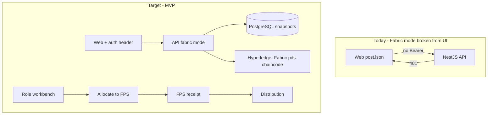
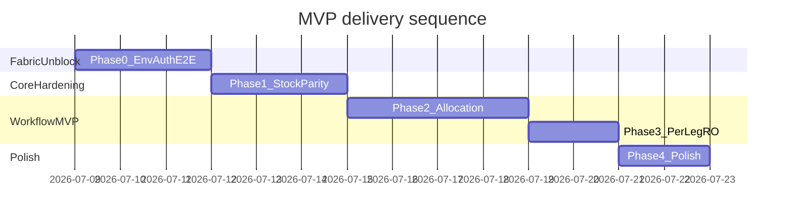

> Historical implementation record. Authentication details below were superseded by the secure-by-default Keycloak/OIDC migration in July 2026. Current deployment instructions are in `DEPLOYMENT.md`; no deployed mode accepts static tokens or stores access tokens in local storage.

# POC → MVP + Fabric Mode Readiness Plan

## Current state


| Area                  | Status                                                                                                                                           |
| --------------------- | ------------------------------------------------------------------------------------------------------------------------------------------------ |
| Demo/mock workflow    | Working — 6 commodities, role workbench, in-process ledger                                                                                       |
| Fabric infrastructure | Implemented — 2-org Docker stack, gateway client, dual-write Postgres                                                                            |
| Fabric UI testing     | **Blocked** — web `[apps/web/src/api.ts](apps/web/src/api.ts)` never sends `Authorization: Bearer`; all mutating calls return 401 in fabric mode |
| FPS delivery          | **Mismatch** — chaincode has `allocateToFps` / `recordFpsReceipt`; workbench uses direct `ISSUE→FPS` transfers                                   |
| Stock in UI           | Computed in mock only (`getSessionStockKg`); no workspace stock API                                                                              |
| Fabric e2e            | Stub only — `[apps/api/test/e2e/fabric-api.e2e.spec.ts](apps/api/test/e2e/fabric-api.e2e.spec.ts)`                                               |





---

## Guiding principles (no regressions)

1. **Demo mode is the regression baseline** — `PDS_LEDGER_MODE=demo` (default) must pass all existing tests unchanged after every phase.
2. **Fabric changes are additive** — new env files, scripts, and opt-in e2e (`PDS_E2E_FABRIC=true`); online demo and Fabric modes both fail closed through OIDC.
3. **Single source of truth for routes** — all workflow and allocation changes flow through `[packages/shared-types/src/index.ts](packages/shared-types/src/index.ts)` `COMMODITY_ROUTE_TEMPLATES`.
4. **Test before merge** — each phase ends with: `npm test`, `npm run smoke` (demo), and (when Fabric stack is up) `npm run smoke:fabric`.

---

## Phase 0 — Unblock Fabric testing (do this first)

**Goal:** You can run the full stack in fabric mode and exercise workflows from the UI within one session.

### 0.1 Environment and bootstrap

- Configure Fabric and OIDC through an untracked `.env` based on `.env.example`:
  ```env
  PDS_LEDGER_MODE=fabric
  PDS_AUTH_MODE=oidc
  PDS_OIDC_ISSUER=http://localhost:8080/realms/viksitpds
  PDS_OIDC_AUDIENCE=pds-api
  VITE_DATA_SOURCE=api
  ```
- Keep `.env.example` aligned with ledger and OIDC configuration; never commit client or user secrets.
- Add root script `smoke:fabric` → `node scripts/smoke-fabric-gateway.mjs` (document in `[DEPLOYMENT.md](DEPLOYMENT.md)`).
- Make Fabric smoke scripts obtain a short-lived Keycloak service-account token.

**Quick-start command block** (add to DEPLOYMENT.md):

```bash
./blockchain/fabric-network/scripts/bootstrap-fabric-full.sh
docker compose --profile iam --profile fabric up --build -d
PDS_BENCHMARK_CLIENT_SECRET='<from secret store>' node scripts/smoke-fabric-gateway.mjs
```

### 0.2 Web API authentication (critical blocker)

Use Keycloak Authorization Code + PKCE-S256 through `apps/web/src/auth-token.ts`. Store OIDC state and access tokens only in session storage, attach bearer tokens to API calls, derive navigation from signed roles, and clear the session on logout.

### 0.3 Ledger mode visibility

- Keep public health output minimal. Authenticated admin network responses expose ledger mode for operator displays.

### 0.4 Fabric e2e test suite

Replace the stub in `[apps/api/test/e2e/fabric-api.e2e.spec.ts](apps/api/test/e2e/fabric-api.e2e.spec.ts)` by porting the happy-path from `[apps/api/test/e2e/demo-api.e2e.spec.ts](apps/api/test/e2e/demo-api.e2e.spec.ts)` and `[apps/api/test/service.test.ts](apps/api/test/service.test.ts)` `supports the role-workbench POC sequence`:

- Guard: `describe.skipIf(process.env.PDS_E2E_FABRIC !== 'true')`
- All requests use a short-lived OIDC token (`PDS_E2E_ACCESS_TOKEN` for test automation or client credentials).
- Assert `trace.verificationSource === 'chaincode'`
- Assert `ledgerTxId` present on distribution

**Exit criteria Phase 0:**

- [ ] `docker compose --profile fabric up` + smoke script passes
- [ ] Web workbench can dispatch/receive one leg against live API with token set
- [ ] `npm test` still green with `PDS_E2E_FABRIC` unset (fabric e2e skipped)

---

## Phase 1 — Calculation parity and stock visibility

**Goal:** Operators see trustworthy quantities; mock mode mirrors chaincode math.

### 1.1 Fix issue-point allocation stock consumption

In `[apps/web/src/workflow-actions.ts](apps/web/src/workflow-actions.ts)` `applyMockWorkflowAction` for `allocate`:

- After creating an FPS allocation, ensure `getSessionStockKg` debits `sourceGodownId` by `allocatedQtyKg`.
- Preferred approach: keep allocation outflow derived from `FPSAllocation` records so mock and API modes use the same source of truth.

Add tests in `[apps/web/test/workflow-actions.test.ts](apps/web/test/workflow-actions.test.ts)`:

- After allocation, issue-point available stock = received - allocated qty
- Cannot allocate received qty + epsilon from issue point

### 1.2 Workspace stock API

Stock exists in Postgres (`stock_positions`) and admin overview but not for operators.

- Add `GET /stock` (or `GET /stock?org=&commodity=`) in new `apps/api/src/modules/stock/` module reading from ledger facade `exportState().stock`.
- Add `loadStockPositions()` in `[apps/web/src/api.ts](apps/web/src/api.ts)`; include in `loadWorkspaceData`.

### 1.3 Stock on workbench action cards

In `[apps/web/src/components/WorkflowActionPanel.tsx](apps/web/src/components/WorkflowActionPanel.tsx)`:

- For `dispatch`, `receive`, `transform-lot` actions, show a `DefinitionList` row:
  - **Available:** `{availableKg} kg`
  - **Required:** `{defaultQty} kg`
- Live mode: read from `/stock`; mock mode: use `getSessionStockKg`.

**Exit criteria Phase 1:**

- [ ] Transform stock tests pass
- [ ] Stock row visible on quantity-editable actions
- [ ] Demo e2e + all unit tests green

---

## Phase 2 — FPS delivery via Allocate + FPS Receipt (your choice)

**Goal:** Use the MVP allocation path for FPS delivery and keep beneficiary distribution FPS-only.

### 2.1 Route template changes

In `[packages/shared-types/src/index.ts](packages/shared-types/src/index.ts)`:

- Keep route templates ending at the issue point, then use `fpsDelivery` for FPS allocation and receipt.
- Add optional `fpsDelivery` block per template:
  ```ts
  fpsDelivery?: {
    allocationId: string;
    sourceGodownId: string; // ISSUE-001
    fpsId: string;          // FPS-101
    allocatedQtyKg: number; // from demoQuantities
  }
  ```
- Apply to: Rice, Wheat, and all `directFpsRoute` commodities.

Update `[packages/fixtures/src/quantities.ts](packages/fixtures/src/quantities.ts)` if per-commodity allocation amounts differ from `fpsAllocationKg`.

### 2.2 Workflow engine changes

In `[apps/web/src/workflow-actions.ts](apps/web/src/workflow-actions.ts)`:

- After issue-point stock is available (last non-FPS leg received for that commodity), queue:
  1. `allocate` action (roles: DEPOT / issue-point operator)
  2. `fps-receipt` action (roles: FPS)
- Keep non-FPS transfer legs ending at the issue point, then use allocation/receipt for FPS.
- Update `getWorkflowProgress` checkpoints: replace FPS transfer receive with allocation + fps-receipt complete.
- Implement full `applyMockWorkflowAction` for `allocate` and `fps-receipt` (today they only emit evidence stubs at line 829) — mirror chaincode:
  - **allocate:** debit `sourceGodownId`, create `FPSAllocation` status `ALLOCATED`
  - **fps-receipt:** credit `fpsId`, mark allocation `RECEIVED`

Wire live path: `[apps/web/src/api.ts](apps/web/src/api.ts)` already maps these to `/fps-allocations` endpoints.

### 2.3 Distribution gate

- Distribution unlocks after the relevant FPS allocation is received.

### 2.4 Tests and fixtures

- Update `[apps/web/test/workflow-actions.test.ts](apps/web/test/workflow-actions.test.ts)` full replay test — expect `allocate` / `fps-receipt` instead of `TR-POC-ISSUE-FPS` / `TR-POC-WHEAT-ISSUE-FPS` etc.
- Update `[apps/api/test/service.test.ts](apps/api/test/service.test.ts)` POC sequence — replace endpoint FPS transfer loop with allocate + receipt.
- Update `[scripts/demo/happy-path.ts](scripts/demo/happy-path.ts)` if present.
- Regenerate seed only if allocation records needed in initial state: `npm run fixtures:sql`.

**Exit criteria Phase 2:**

- [ ] Full Rice + Kerosene mock replay completes with allocation path
- [ ] API service test POC sequence passes in demo mode
- [ ] Fabric e2e (opt-in) passes allocation + distribution

---

## Phase 3 — Per-leg RO-lite authorization

**Goal:** Each Stage-II leg requires its own approval event (practical governance).

### 3.1 Authorization model

In `[apps/web/src/workflow-actions.ts](apps/web/src/workflow-actions.ts)`:

- Replace single `authorized` boolean with `isLegAuthorized(legId)` checking `ledgerEvents` for `entityId === leg.id` (not just the first `authorizationLeg`).
- Queue `authorize-movement` per leg when `leg.requiresAuthorization && !isLegAuthorized(leg.id) && prior legs complete`.
- Remove upfront global RO action before Stage-I. Rice now offers `TR-POC-RICE-DEPOT-ISSUE` approval only after upstream receipts.

In chaincode/API: `authorizeMovement` already keys by `transferId` — no backend change needed.

### 3.2 UI

- Authorization cards show which leg they unlock.
- CONTROL_OFFICE role queue surfaces all pending per-commodity approvals.

**Exit criteria Phase 3:**

- [ ] Unauthorized Stage-II dispatch still blocked per leg
- [ ] Stage-I proceeds without Stage-II approval
- [ ] Existing unauthorized-dispatch test updated, not removed

---

## Phase 4 — MVP polish (practical daily use)

### 4.1 Operator experience

- Show `ledgerTxId` on workflow success alerts (already partially done for distribute/receive).
- `[TransfersPage](apps/web/src/pages/workspace/TransfersPage.tsx)` / `[LotsPanel](apps/web/src/components/DataPanels.tsx)`: add commodity filter column (already partially multi-commodity).
- Pending receipts dashboard metric: split in-transit transfers vs pending FPS allocations (`[apps/web/src/lib/role-summary.ts](apps/web/src/lib/role-summary.ts)`).

### 4.2 Documentation alignment

- Reconcile Fabric version docs: `[DEPLOYMENT.md](DEPLOYMENT.md)` and `[docs/technical/technical-stack.md](docs/technical/technical-stack.md)` currently say 3.1.x; compose uses `2.5.13` — document actual version or bump images (separate decision; do not block Fabric testing).
- Update `[docs/implementation/mvp-implementation-plan.md](docs/implementation/mvp-implementation-plan.md)` Gate 3 status and workflow diagram.

### 4.3 Demo scripts

- `[scripts/demo/happy-path.mjs](scripts/demo/happy-path.mjs)` — support `--ledger=fabric` with auth token.
- `[scripts/demo/exception-path.mjs](scripts/demo/exception-path.mjs)` — short receipt + duplicate claim.

**Exit criteria Phase 4:** Stakeholder can complete happy + exception path in fabric mode from UI without reading source code.

---

## Regression matrix (run every phase)

Run the full automated demo profile:

```bash
npm run regression
```

With a live Fabric stack (`docker compose --profile fabric up -d`) and auth token:

```bash
PDS_BENCHMARK_CLIENT_SECRET='<from secret store>' npm run regression:fabric
```

| Command | Mode | Expected | Automated in `npm run regression` |
| ------- | ---- | -------- | --------------------------------- |
| `npm test` | demo (default) | All workspaces green | Yes |
| `npm run test --workspace=apps/web` | unit | workflow + panel tests pass | Yes |
| `npm run smoke` | demo API | Pass | Yes (in-process smoke) |
| `npm run demo:happy` / `demo:exception` | demo | Pass | Yes |
| `npm run smoke:fabric` | fabric | Gateway smoke pass | Yes (`regression:fabric` only) |
| `PDS_E2E_FABRIC=true … fabric-api.e2e` | fabric (live stack) | Fabric e2e pass | Yes (`regression:fabric` only) |
| Manual | web + `VITE_DATA_SOURCE=api` + demo mode | Workbench unchanged for teams not on Fabric yet | Printed reminder |

**Exit criteria (regression gates):**

- [x] `npm run regression` passes on a clean checkout (demo mode)
- [x] Demo happy + exception scripts included in regression runner
- [x] Fabric profile documented and runnable via `npm run regression:fabric`
- [ ] Manual web workbench sanity check before stakeholder demos (operator checklist above)


---

## Suggested execution order




**Start Fabric testing after Phase 0** (same day as bootstrap + auth). Phases 1–3 can proceed while you run parallel fabric validation.

---

## Out of scope (defer post-MVP)

- Full 5-org Fabric consortium deployment
- Real JWT / Keycloak login
- Per-controller API RBAC (chaincode MSP remains enforcement seam)
- Commodity-specific non-FPS retail or cooked-meal endpoints
- Kubernetes / pilot deployment

---

## Key files to touch


| Phase | Files                                                                                                                                                                                                                                              |
| ----- | -------------------------------------------------------------------------------------------------------------------------------------------------------------------------------------------------------------------------------------------------- |
| 0     | `[apps/web/src/api.ts](apps/web/src/api.ts)`, `[docker-compose.yml](docker-compose.yml)`, `[.env.example](.env.example)`, `[apps/api/test/e2e/fabric-api.e2e.spec.ts](apps/api/test/e2e/fabric-api.e2e.spec.ts)`, `[DEPLOYMENT.md](DEPLOYMENT.md)` |
| 1     | `[apps/web/src/workflow-actions.ts](apps/web/src/workflow-actions.ts)`, new `apps/api/src/modules/stock/`, `[WorkflowActionPanel.tsx](apps/web/src/components/WorkflowActionPanel.tsx)`                                                            |
| 2     | `[packages/shared-types/src/index.ts](packages/shared-types/src/index.ts)`, `[workflow-actions.ts](apps/web/src/workflow-actions.ts)`, `[service.test.ts](apps/api/test/service.test.ts)`                                                          |
| 3     | `[workflow-actions.ts](apps/web/src/workflow-actions.ts)`, workflow tests                                                                                                                                                                          |
| 4     | demo scripts, docs, dashboard polish                                                                                                                                                                                                               |
