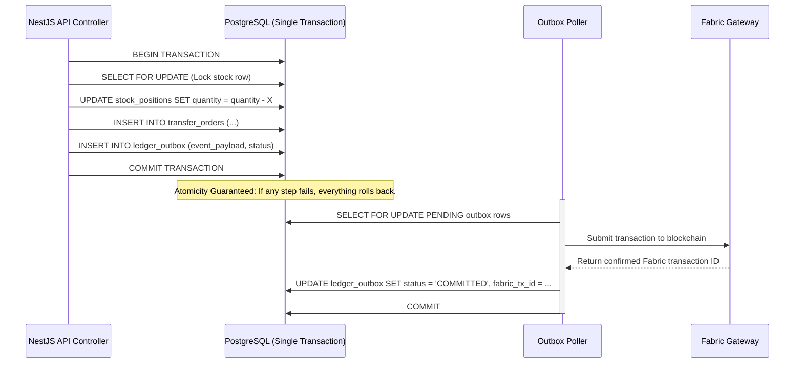

# Technical Plan: Postgres Atomicity, Concurrency, and Transactional Outbox Refactor

> Current status, 23 July 2026: this is a target design, not completed
> repository-wide behavior. Canonical source ingestion has an atomic PostgreSQL
> slice, but FPS receipt, distribution, and the remaining operational commands
> still depend on the snapshot runtime. The maintained gate and acceptance
> status are in
> [MVP hardening](../implementation/mvp-hardening-plan.md).
>
> `RecordLedgerProof` is the only maintained API submission boundary. Current
> outbox states are `PENDING`, `SUBMITTING`, `COMMITTED`, `FAILED`, and
> `DEAD_LETTER`; older `PROCESSED` examples below are superseded.

This document analyzes the feedback regarding the non-atomic state updates and unsafe full-table TRUNCATE-and-rebuild snapshots in ViksitPDS, and outlines a comprehensive plan to transition to an **Incremental Transactional Outbox** pattern.

> **Review-traceable checklist:** For the full Gemini-architecture-review remediation (Postgres SoT, read-path OOM, REST roles, chaincode key-scope, and finding-specific tests), use [`implementation_plan.md`](../../implementation_plan.md) as the authoritative workstream checklist. This file remains the deeper Postgres write-path design note.

---

## 1. Analysis of Current Vulnerabilities

The feedback highlights two critical flaws in the current MVP persistence model:

### Issue A: Non-Atomic Dual Writes (Split-Brain Risk)
* **How it works now:** The `PdsRuntime` mutation flow exports the entire state, calls `postgresPort.saveState(state)` (which truncates and inserts into the database), commits that transaction, and only afterward calls `port.appendEvents(newEvents)` to queue events in `ledger_outbox`.
* **The Failure Scenario:** If the API container crashes, or the database connection drops immediately after `saveState` commits but before `appendEvents` executes, the database contains the updated operational state (e.g., stock is debited), but the events are never written to the outbox. Consequently, the blockchain ledger never reconciles this transaction, causing permanent split-brain divergence.

### Issue B: Stale State Overwrites (Horizontal Scaling Failure)
* **How it works now:** `buildSnapshotWritePlan` truncates the operational tables (`TRUNCATE stakeholders, commodity_lots, stock_positions... CASCADE`) and performs bulk inserts of all records currently held in the local API instance's in-memory `PdsLedgerEngine`.
* **The Failure Scenario:** If multiple API replicas are deployed behind a load balancer, they each maintain separate in-memory engine objects. If Replica A processes a lot creation and Replica B processes a dispatch order concurrently:
  1. Replica A exports its state and updates the DB (truncating and inserting its state).
  2. Replica B exports its state (which does *not* contain the lot created on Replica A) and writes to the DB (truncating all tables and inserting its state).
  3. The lot created by Replica A is **permanently deleted** from the database.

---

## 2. Proposed Architecture: Incremental Transactional Outbox

To resolve these issues, we must:
1. **Abandon the in-memory engine (`PdsLedgerEngine`) as the active state source of truth** in `PDS_LEDGER_MODE=fabric` / database mode.
2. **Execute all state updates incrementally** via row-level SQL operations.
3. **Bundle the operational updates and outbox insertions** into a single PostgreSQL transaction block.



---

## 3. Step-by-Step Refactoring Plan

### Phase 1: DB Schema Enhancement for Concurrency

To support concurrent API replicas, we must add concurrency guards (Optimistic Locking and Foreign Key Constraints) directly to the Postgres tables.

1. **Add a `version` column to mutable tables** for Optimistic Concurrency Control (OCC):
   ```sql
   ALTER TABLE stock_positions ADD COLUMN version INTEGER DEFAULT 1 NOT NULL;
   ALTER TABLE monthly_entitlements ADD COLUMN version INTEGER DEFAULT 1 NOT NULL;
   ```
2. **Add Missing Foreign Keys & Indexes** to prevent orphan records and optimize query performance:
   * Index on `ledger_outbox(status, created_at)` to enable high-speed polling.
   * Foreign keys from `transfer_orders(from_org)` to `stakeholders(stakeholder_id)`.

---

### Phase 2: Refactoring Ledger Ports & Removing Snapshotting

We must replace the batch snapshot behavior with incremental mutations. 

#### 1. Redefine the `PdsLedgerPort` Interface
Modify the interface to handle discrete, incremental operations rather than bulk state dumps:

```typescript
export interface PdsLedgerPort {
  // Incremental mutations
  createCommodityLot(lot: CommodityLot, event: LedgerEvent): Promise<string>;
  dispatchLot(transfer: TransferOrder, event: LedgerEvent): Promise<string>;
  receiveLot(transfer: TransferOrder, event: LedgerEvent): Promise<string>;
  recordDistribution(dist: DistributionTransaction, event: LedgerEvent): Promise<string>;
  
  // Queries load data directly from DB
  getLot(lotId: string): Promise<CommodityLot | null>;
  getStock(orgId: string, commodity: string): Promise<number>;
}
```

#### 2. Implement Incremental Transactional Operations in `PostgresPdsLedgerPort`
Every write operation must borrow a database client from the pool and run inside a `BEGIN / COMMIT` block, combining business logic writes and outbox appends:

```typescript
// apps/api/src/infrastructure/postgres-ledger-port.ts

export class PostgresPdsLedgerPort implements PdsLedgerPort {
  constructor(private readonly pool: Pool) {}

  async dispatchLot(transfer: TransferOrder, event: LedgerEvent): Promise<string> {
    const client = await this.pool.connect();
    try {
      await client.query('BEGIN');

      // 1. Lock and retrieve current stock (Pessimistic Locking)
      const stockRes = await client.query(
        'SELECT quantity_kg FROM stock_positions WHERE stakeholder_id = $1 AND commodity = $2 FOR UPDATE',
        [transfer.fromOrg, event.payload.commodity]
      );
      
      const currentStock = stockRes.rows[0]?.quantity_kg ?? 0;
      if (currentStock < transfer.dispatchedQtyKg) {
        throw new Error('Insufficient stock for dispatch');
      }

      // 2. Decrement sender stock
      await client.query(
        'UPDATE stock_positions SET quantity_kg = quantity_kg - $1 WHERE stakeholder_id = $2 AND commodity = $3',
        [transfer.dispatchedQtyKg, transfer.fromOrg, event.payload.commodity]
      );

      // 3. Create transfer record
      await client.query(
        `INSERT INTO transfer_orders (transfer_id, lot_id, from_org, to_org, dispatched_qty_kg, status, dispatch_timestamp) 
         VALUES ($1, $2, $3, $4, $5, $6, $7)`,
        [transfer.transferId, transfer.lotId, transfer.fromOrg, transfer.toOrg, transfer.dispatchedQtyKg, 'DISPATCHED', transfer.dispatchTimestamp]
      );

      // 4. Insert Ledger Event into Outbox in the SAME transaction
      await client.query(
        `INSERT INTO ledger_outbox (event_id, event_payload, status, created_at) 
         VALUES ($1, $2, 'PENDING', NOW())`,
        [event.ledgerTxId, JSON.stringify(event)]
      );

      await client.query('COMMIT');
      return event.ledgerTxId;
    } catch (err) {
      await client.query('ROLLBACK');
      throw err;
    } finally {
      client.release();
    }
  }
}
```

---

### Phase 3: Implementing Optimistic Concurrency Control (OCC)

For entities that can be edited concurrently by separate API workers (e.g., beneficiary monthly entitlement records), apply Optimistic Locking.

```typescript
async recordDistribution(dist: DistributionTransaction, event: LedgerEvent): Promise<string> {
  const client = await this.pool.connect();
  try {
    await client.query('BEGIN');

    // 1. Fetch current entitlement and its version
    const entRes = await client.query(
      'SELECT available_balance_kg, already_lifted_kg, version FROM monthly_entitlements WHERE ration_card_hash = $1 AND month = $2',
      [dist.rationCardHash, event.payload.month]
    );
    const entitlement = entRes.rows[0];
    if (!entitlement) throw new Error('Entitlement not found');

    if (entitlement.available_balance_kg < dist.deliveredKg) {
      throw new Error('Requested quantity exceeds entitlement balance');
    }

    // 2. Perform update, incrementing version and checking old version matches
    const updateRes = await client.query(
      `UPDATE monthly_entitlements 
       SET available_balance_kg = available_balance_kg - $1, 
           already_lifted_kg = already_lifted_kg + $1, 
           version = version + 1 
       WHERE ration_card_hash = $2 AND month = $3 AND version = $4`,
      [dist.deliveredKg, dist.rationCardHash, event.payload.month, entitlement.version]
    );

    // 3. Concurrency check: If no rows were updated, someone else edited this record concurrently
    if (updateRes.rowCount === 0) {
      throw new Error('Concurrency conflict: Entitlement record was modified by another request. Please retry.');
    }

    // 4. Insert outbox record...
    await client.query('INSERT INTO ledger_outbox...');

    await client.query('COMMIT');
    return event.ledgerTxId;
  } catch (err) {
    await client.query('ROLLBACK');
    throw err;
  } finally {
    client.release();
  }
}
```

---

## 4. Operational Alignment with Fabric Gateway

Under the refactored architecture, the blockchain synchronization flow functions as follows:

1. **Immediate API Response:**
   Once the database transaction (containing the business update and pending outbox record) commits successfully, the API returns a `201 Created` status with the calculated event ID to the client. The client is assured that the transaction is safely registered.
2. **Reliable Async Ledger Submission:**
   The outbox poller fetches eligible rows with `FOR UPDATE SKIP LOCKED`,
   transitions them through `SUBMITTING`, calls `RecordLedgerProof`, and records
   `COMMITTED` plus the real Fabric transaction ID only after commit
   confirmation. Retryable errors become `FAILED`; exhausted retries become
   `DEAD_LETTER`.
3. **Auto-Recovery on Crash:**
   If the API container crashes midway during Fabric submission, the outbox row remains marked as `PENDING`. Upon restart, the poller picks up where it left off, guaranteeing eventual consistency with zero loss of audit events.
