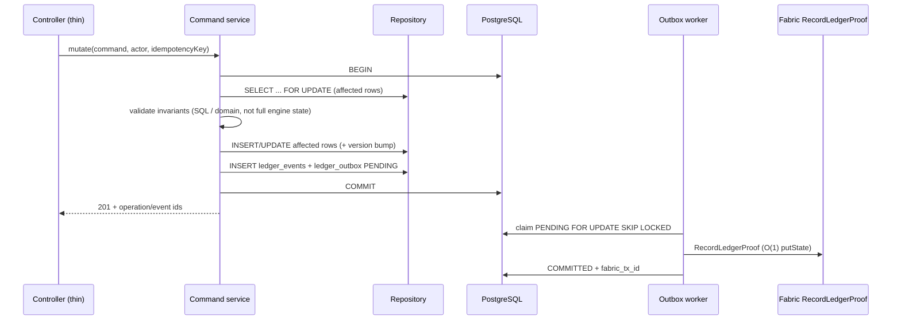

# Implementation Plan: Postgres SoT Migration, Outbox Atomicity, API Role Guards, and Chaincode Key-Scoped Access

This plan remediates every finding in [`gemini-flash-pds_architecture_review.md`](./gemini-flash-pds_architecture_review.md) and closes the gaps called out against the prior outline. It aligns with:

- [`docs/technical/postgres_atomicity_and_concurrency_plan.md`](./docs/technical/postgres_atomicity_and_concurrency_plan.md)
- [`docs/implementation/mvp-hardening-plan.md`](./docs/implementation/mvp-hardening-plan.md) Phase 2
- [`AGENTS.md`](./AGENTS.md) architectural rules

**Status of this document:** authoritative remediation design for the Gemini review themes. Prefer this file over the earlier short outline when sequencing work.

**Current codebase note (2026-07-15):** partial progress exists (`BusinessAuthGuard` + Reflector, some `@Roles`, OCC columns on a subset of tables, transitional `executeMutationTx` in `PdsRuntime`). That hybrid still rehydrates partial rows into `PdsLedgerEngine`, still has a snapshot/`persist()` dual-write path, and does **not** satisfy Phase 2 acceptance. Treat items below as required completion criteria, not optional polish.

---

## Traceability: review finding → plan workstream

| Review finding | Severity | Workstream | Done when |
| :--- | :--- | :--- | :--- |
| §2 Full-state TRUNCATE + in-memory Maps (both modes) | Critical | **A** Postgres SoT + write path | No mutating path calls `buildSnapshotWritePlan` / `TRUNCATE` outside reset tooling; DB is SoT in fabric/DB mode |
| §2 Startup `loadState()` SELECT * OOM | Critical | **B** Read-path / hydrate | Boot and query paths load row-scoped data; no full-history Map hydrate required for mutations |
| §2 Zero multi-replica concurrency | Critical | **A** + **C** OCC/locks + tests | Concurrent dual-writer tests pass; no snapshot wipe |
| §3A `RecordLedgerProof` O(1) | Informational | **—** | Left unchanged (production outbox path) |
| §3B Compatibility `loadCollection`/`saveCollection` | High | **D** Chaincode key-scope | All mutating compatibility txs are key-scoped; collection scans limited to explicit read-only queries or removed |
| §4 `saveState` then `appendEvents` split-brain | Critical | **A** Transactional outbox | Business rows + `ledger_events` + `ledger_outbox` commit on one client in one `BEGIN`/`COMMIT` |
| §5 Unauthenticated mutating REST | High | **E** Role guards | Every mutating business endpoint has `@Roles` in fabric/pilot; negative auth tests pass |

---

## Target architecture



**Non-negotiable rules**

1. PostgreSQL is authoritative for operational workflow state.
2. In `PDS_LEDGER_MODE=fabric` (and any DB-backed mode), **do not** use `PdsLedgerEngine` as the live source of truth. The engine may remain for demo/file mode and for unit tests of pure domain rules extracted into shared pure functions.
3. Controllers stay thin. Transaction orchestration lives in **command services**. SQL lives in **repositories**.
4. Fabric proof delay/failure must not roll back a committed Postgres operation; proofs stay retryable via outbox.
5. Runtime `TRUNCATE` is forbidden outside explicit reset/import/test tooling.
6. Production API path continues to submit only `RecordLedgerProof`. Named chaincode business txs are compatibility surfaces to harden or deprecate—not new API integration points.

---

## Workstream A — Transactional write path (closes §2 write + §4)

### A.1 Schema (additive, rerunnable)

#### [MODIFY] [`infra/postgres/schema.sql`](infra/postgres/schema.sql)

Add/confirm `version INTEGER NOT NULL DEFAULT 1` (or equivalent) on **all mutable operational tables**, not only stock/entitlements:

| Table | OCC `version` | Notes |
| :--- | :--- | :--- |
| `commodity_lots` | Required (already present; normalize default to 1) | Movement / remaining qty |
| `stock_positions` | Required (present) | Balance debit/credit |
| `monthly_entitlements` | Required (present) | Lift / entitlement spend |
| `transfer_orders` | Required | Status transitions |
| `fps_allocations` | Required | Allocate / receipt |
| `distribution_transactions` | Required if updatable; else immutable insert-only | Prefer insert-only + unique id |
| `auth_transactions` | Prefer insert-only + unique id | Idempotency via PK / unique keys |
| `audit_alerts` | Required | Reconcile / resolve |
| `stakeholders` | Required | Register / status changes |
| `workflow_instances` | Already present | Keep |
| `ledger_outbox` | N/A for OCC | Keep status machine + unique `event_id` / `idempotency_key` |

Also confirm indexes used by lock/poll patterns:

- `ledger_outbox(status, next_attempt_at)` and/or `(status, created_at)` for poller claims
- Unique indexes on command idempotency keys where commands accept `Idempotency-Key` / operation ids

Do not edit generated `seed.sql` by hand; update fixtures and run `npm run fixtures:sql` when seed rows need new columns.

### A.2 Layering (replace port-centric orchestration)

Stop centering mutation orchestration in `PostgresPdsLedgerPort` / `PdsRuntime.executeMutationTx`.

| Layer | Responsibility | Location (target) |
| :--- | :--- | :--- |
| Controllers | DTO validation, auth context, call command service | `apps/api/src/modules/*/*.controller.ts` |
| Command services | `BEGIN`/`COMMIT`, invariant checks, idempotency, emit events | e.g. `apps/api/src/modules/*/commands/*.ts` |
| Repositories | Parameterized SQL, `FOR UPDATE`, versioned updates | `apps/api/src/infrastructure/repos/*.ts` |
| Outbox writer | Insert `PENDING` row with proof envelope fields | Same TX as business write |
| Outbox worker | Claim → Fabric submit → `COMMITTED` / retry / `DEAD_LETTER` | Existing poller (keep semantics) |

Extract pure validators from `PdsLedgerEngine` (quantity > 0 integer kg, no over-dispatch, lineage rules) into shared testable functions so command services do not need a full engine instance.

### A.3 Per-command transaction contract

For every mutating command (dispatch, receive, authorize, create lot, allocate, FPS receipt, create entitlement, record distribution, auth simulate, reconcile/resolve alert, register stakeholder, …):

1. `BEGIN` on one `PoolClient`
2. `SELECT … FOR UPDATE` on every row whose balance/status will change
3. Validate invariants
4. `UPDATE … SET …, version = version + 1 WHERE … AND version = $expected` (or conditional balance update); treat `rowCount = 0` as conflict
5. `INSERT` new rows (child lots, transfers, distributions, events)
6. Insert matching `ledger_events` **and** `ledger_outbox` (`PENDING`) with `eventId`, `operationId`, actor, role, org, payload hash, schema version, entity ids, API business timestamp
7. `COMMIT` — or `ROLLBACK` on any failure

**Remove** sequential `port.saveState(state)` then `port.appendEvents(newEvents)` from the fabric/DB mutation path (`PdsRuntime.persist` dual-write). Keep file/demo adapters only where snapshot persistence is still intentional for local non-DB demos.

### A.4 Migration order (vertical slices)

Migrate one mutation vertical at a time; each slice must ship with concurrency + crash tests before the next:

1. Create lot + stock credit
2. Dispatch / receive / authorize transfer
3. Allocate to FPS + FPS receipt
4. Create entitlement + record distribution
5. Auth transaction recording
6. Stakeholder register
7. Audit reconcile / resolve
8. Delete / quarantine snapshot write path for DB mode

Acceptance for Workstream A: Phase 2 gate in mvp-hardening-plan — row-scoped commands and outbox insert share one DB transaction; snapshot engine no longer used for fabric/DB mutations.

---

## Workstream B — Read path / memory footprint (closes §2 OOM hydrate)

The review’s OOM claim is not only TRUNCATE writes. `bootstrapFromPersistenceAsync()` → `loadState()` → `SELECT *` into Maps will still exhaust heap at government scale even after write refactor.

### B.1 Boot

- In fabric/DB mode: **do not** hydrate the full operational history into `PdsLedgerEngine` Maps at startup.
- Load only what the process needs for health (DB ping, outbox worker start, optional small reference caches).
- List/get endpoints read from repositories with filters/pagination; no “export entire state” on the hot path.

### B.2 Query APIs

- Replace in-memory list methods used by controllers with SQL-backed repository queries (`LIMIT`/`OFFSET` or keyset pagination for large tables).
- Keep privacy rules: never return raw Aadhaar, biometrics, OTP, phones, full ration-card numbers, or unmasked beneficiary PII.

### B.3 Demo / file mode

- File and pure in-memory demo mode may retain the engine + optional snapshot for local UX.
- Document clearly: demo mode is not multi-replica or crash-safe.

Acceptance for Workstream B: fabric/DB mode API can start and serve mutations/queries without loading all historical rows into process memory.

---

## Workstream C — Concurrency controls (closes §2 multi-replica)

### C.1 Locking strategy

- **Pessimistic:** `SELECT … FOR UPDATE` on stock, lot remaining qty, entitlement balance, transfer/allocation rows being transitioned.
- **Optimistic:** `version` predicate on UPDATE; conflict → `409` / domain conflict, safe to retry if idempotent.

### C.2 Idempotency

- Accept and persist command idempotency keys (header or body) with a unique constraint.
- Identical replay returns the original result; conflicting reuse returns conflict.
- Outbox `event_id` uniqueness remains; identical proof replay on Fabric must succeed, conflicting content must fail (existing chaincode rule — preserve).

### C.3 Outbox status semantics (preserve)

| Status | Meaning |
| :--- | :--- |
| `PENDING` | Ready or scheduled |
| `SUBMITTING` | Claimed by one worker |
| `COMMITTED` | Fabric success + `fabric_tx_id` |
| `FAILED` | Retryable; `next_attempt_at` set |
| `DEAD_LETTER` | Retry exhausted; manual retry only |

Never mark committed before Fabric commit status succeeds.

---

## Workstream D — Chaincode key-scoped access (closes §3B; preserves §3A)

### D.1 Do not change production proof path

`RecordLedgerProof` stays O(1) composite-key `getState`/`putState`. Outbox worker remains the only API→Fabric write integration.

### D.2 Compatibility mutating transactions — full inventory

Replace `loadCollection` / `saveCollection` on **every mutating** compatibility transaction below with discrete composite keys (`createCompositeKey` + `getState` / `putState`). Event appends must be key-scoped (e.g. `event` + tx/event id), not full `events` array rewrite.

**Control plane**

- `RegisterStakeholder`
- `IssueRationCard`
- `ActivateRationCard`
- `SuspendRationCard`
- `TransferRationCard`
- `ProposeEntitlementRule`
- `ApproveEntitlementRule`
- `RolloverUnclaimedQuota`

**Logistics / distribution**

- `CreateCommodityLot`
- `DispatchLot`
- `ReceiveLot`
- `AllocateToFPS`
- `RecordFPSReceipt`
- `RegisterBeneficiaryHash`
- `CreateMonthlyEntitlement`
- `RecordDistribution`
- `RaiseAuditFlag`
- `ResolveAuditFlag`

**Grievance**

- `FileGrievance`
- `AcknowledgeGrievance`
- `ResolveGrievance`
- `EscalateOverdueGrievances` — if it must scan, bound the scan and avoid rewriting unrelated collections; prefer indexed keys by due date if kept

**Read-only / query txs** (`Get*`, `VerifyDatabaseHash`, `CheckDuplicateClaim`, history helpers)

- Prefer key/partial-key queries with explicit limits.
- Do **not** `saveCollection` after reads.
- Document any remaining prefix scan as query-only and non-endorsement-hot-path.

### D.3 Determinism (preserve)

Derive tx ids and execution timestamps from `ctx.stub.getTxID()` and `ctx.stub.getTxTimestamp()`. No `randomUUID()`, `Date.now()`, `new Date()` as execution clock, randomness, process/network/filesystem state in endorsed logic.

### D.4 Policy

Any endorsement/discovery change must be tested against **Food and Godown** peers. Use MSP id `GodownWarehouseMSP`.

Acceptance for Workstream D: mutating compatibility txs do not call `loadCollection`/`saveCollection`; chaincode unit tests stub composite-key iteration and assert no full-collection rewrite on those methods.

---

## Workstream E — REST role guards (closes §5)

### E.1 Guard behavior (document explicitly)

[`BusinessAuthGuard`](apps/api/src/modules/auth/auth.guard.ts) is a global `APP_GUARD`:

| Mode | Behavior |
| :--- | :--- |
| `PDS_LEDGER_MODE=demo` | Business endpoints open (dev UX); warning logged once |
| `fabric` / pilot | Bearer token required; `@Roles(...)` enforced when present |

This plan does **not** claim demo mode is locked down. Fabric/pilot mode must be.

### E.2 Reflector + `@Roles` (complete coverage)

Keep [`roles.decorator.ts`](apps/api/src/modules/auth/roles.decorator.ts) and Reflector-backed `optionsFor`.

Annotate **every** mutating business endpoint (not only the ones named in the Gemini review):

| Controller | Method | Roles |
| :--- | :--- | :--- |
| `TransfersController` | `POST /transfers` | `procurement`, `godown` |
| `TransfersController` | `POST /transfers/:id/receive` | `godown`, `fps` |
| `TransfersController` | `POST /transfers/:id/authorize` | `department` |
| `LotsController` | `POST /lots` | `procurement` |
| `DistributionsController` | `POST /distributions` | `fps` |
| `EntitlementsController` | `POST /entitlements` | `department` |
| `StakeholdersController` | `POST /stakeholders` | `department` |
| `AllocationsController` | `POST /fps-allocations` | `godown`, `department` |
| `AllocationsController` | `POST /fps-allocations/:id/receipt` | `fps` |
| `AuthController` | `POST /auth/mock-otp` | `fps` |
| `AuthController` | `POST /auth/simulated-biometric` | `fps` |
| `AuthController` | `POST /auth/supervisor-exception` | `fps`, `department` |
| `AuditController` | `POST /audit-alerts/reconcile` | `auditor`, `department` |
| `AuditController` | `POST /audit-alerts/:id/resolve` | `auditor`, `department` |
| `AdminController` | existing `AdminGuard` | keep admin token path |

Read/validate endpoints may remain “any authenticated” in fabric mode (no `@Roles`) unless product policy tightens later. `POST /entitlements/validate` and `POST /trace/verify` should still require authentication in fabric mode (global guard) even if role-open.

---

## Workstream F — Verification (must prove the review findings are fixed)

Generic `build` / `lint` / `test` / lifecycle is necessary but **not sufficient**.

### F.1 Automated — always

```sh
npm run build
npm run typecheck
npm run lint
npm test
npm run test:demo-http
```

### F.2 Automated — finding-specific (add with the workstreams)

| Test class | Proves |
| :--- | :--- |
| Same-TX outbox | After command commit, outbox row exists; forced failure before outbox insert rolls back business rows |
| Crash / dual-write absence | No code path in fabric/DB mode calls `saveState` then `appendEvents` as separate commits |
| Concurrent stock/entitlement | Two parallel commands; one wins, other conflicts or serializes; balances never negative / double-spent |
| Idempotency | Replay same key → same result; conflicting body → conflict |
| Auth deny | fabric mode: missing token → 401; wrong role → 401/403 on each `@Roles` route |
| Auth demo caveat | demo mode: mutating route succeeds without token (documented behavior) |
| No snapshot on mutate | Mutating commands do not emit `TRUNCATE` (spy/assert on SQL or use DB trigger/test harness) |
| Chaincode O(1) mutate | Unit tests: mutating compat txs never invoke collection load/save helpers |
| Proof path unchanged | `RecordLedgerProof` identical-replay / conflict / privacy validation still pass |
| Two-peer Fabric | `PDS_E2E_FABRIC=true npm run regression:fabric` after chaincode changes |

### F.3 Manual / live lifecycle

```sh
PDS_DEV_AUTH_TOKEN=dev-mvp-token \
PDS_ADMIN_TOKEN=admin-mvp-token \
node scripts/live-lifecycle.mjs
```

Assert operational success **and** outbox completion (`PENDING`/`FAILED`/`DEAD_LETTER` counts = 0 for the run). Do not run destructive Fabric bootstrap unless explicitly authorized.

### F.4 Reporting

Lead with verified outcomes. Distinguish unit/build, HTTP/demo, live Fabric, and operational vs proof completion. Do not claim near-MVP complete while Phase 2 gate remains open. Do not treat a single-replica lifecycle pass as evidence of crash atomicity or multi-replica safety unless the concurrency/crash suites above pass.

---

## Explicit non-goals / deferred

- Replacing the embedded outbox poller with a standalone worker process (same Postgres queue semantics when done later).
- BullMQ or non-Postgres queues.
- Making demo mode authenticated (optional later).
- Using named chaincode business txs from the NestJS API (forbidden as integration surface).
- Claiming production readiness or multi-region HA.

---

## Dependency order

```text
E (auth roles) ─────────────────────────────┐
A.1 schema ──► A.2/A.3 first vertical ──► C tests ──► remaining verticals ──► A.4 remove snapshot path
B read-path can proceed in parallel after first vertical proves row-scoped reads
D chaincode key-scope parallel after Phase 1 proof boundary stays green; two-peer verify before upgrade
F tests land with each workstream, not only at the end
```

---

## Documentation updates required when behavior lands

- [`docs/implementation/mvp-hardening-plan.md`](./docs/implementation/mvp-hardening-plan.md) — mark Phase 2 progress/gates honestly
- [`docs/product/assumptions-for-demo.md`](./docs/product/assumptions-for-demo.md) — single-replica / demo auth caveats until gates pass
- [`docs/technical/postgres_atomicity_and_concurrency_plan.md`](./docs/technical/postgres_atomicity_and_concurrency_plan.md) — keep in sync; this file is the review-traceable checklist
- [`AGENTS.md`](./AGENTS.md) — only if architectural rules change (prefer not to weaken them)

---

## Completion checklist (Gemini review closed)

- [ ] Fabric/DB mutations: one Postgres transaction for business + events + outbox
- [ ] No TRUNCATE snapshot on mutation paths
- [ ] Fabric/DB mode does not full-hydrate history into Maps for SoT
- [ ] OCC + `FOR UPDATE` + idempotency on balance-bearing commands
- [ ] Concurrent and crash/outbox tests green
- [ ] All mutating REST business endpoints `@Roles`-annotated; fabric deny tests green
- [ ] Demo-mode open access documented, not confused with fabric security
- [ ] All mutating compatibility chaincode txs key-scoped; `RecordLedgerProof` unchanged
- [ ] Two-peer Fabric regression green after chaincode upgrade
- [ ] Maintained docs updated; Phase 2 gate not falsely marked complete
